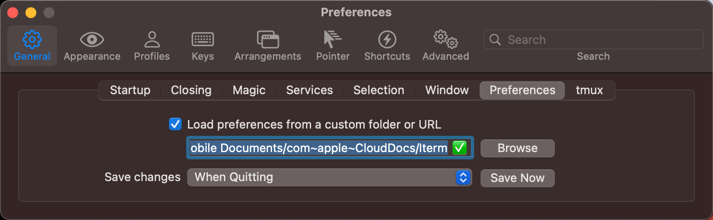
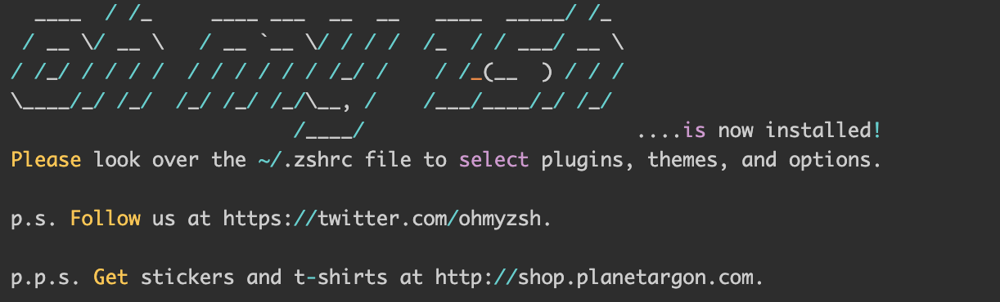
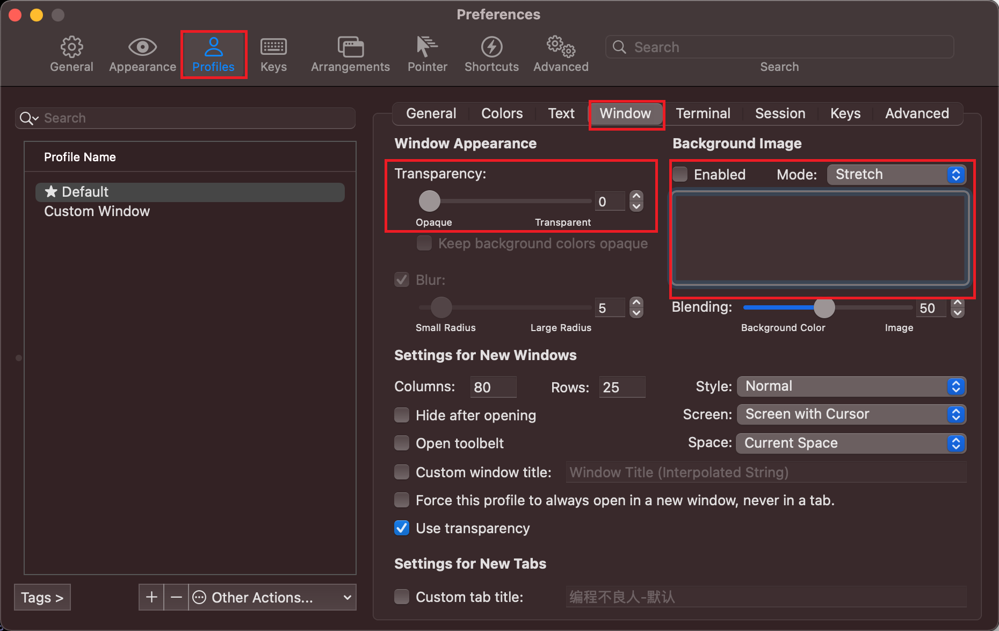
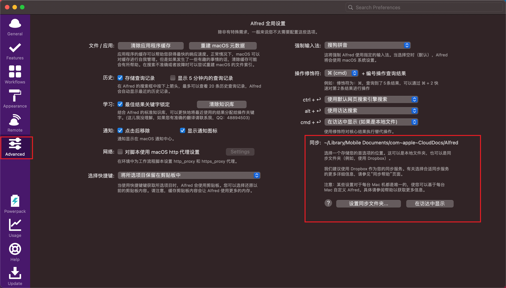
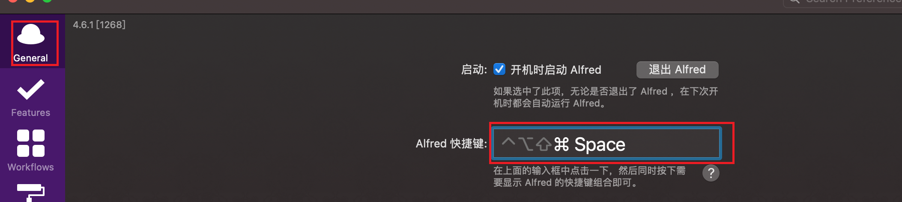
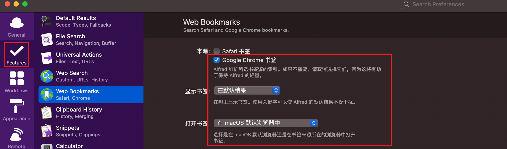
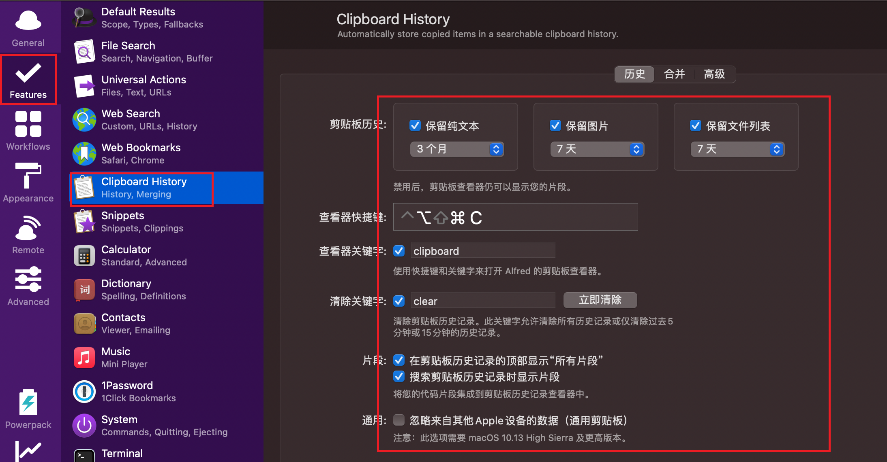
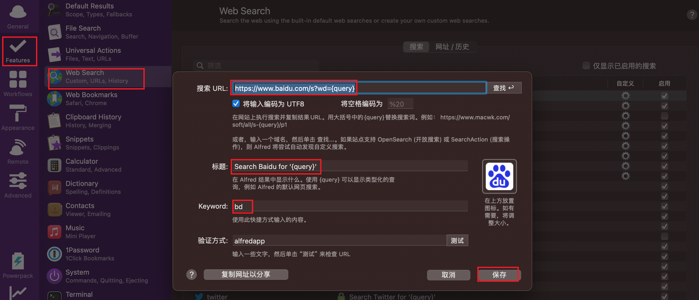

# Mac 深度使用技巧

- 首次激活
- 软件推荐
- 使用技巧

## 首次激活

- `安装软件`

### brew

`brew 包管理工具`

https://brew.sh/

```markdown
# 1.安装 brew (科学上网)
```

```shell
/bin/bash -c "$(curl -fsSL https://raw.githubusercontent.com/Homebrew/install/HEAD/install.sh)"
```

```markdown
# 2.自动化脚本安装软件
```

```shell
ALL_PROXY=socks5://127.0.0.1:1080 /opt/homebrew/bin/brew install bat docker-compose fzf git maven nvm wget;

ALL_PROXY=socks5://127.0.0.1:1080 /opt/homebrew/bin/brew install --cask --no-quarantine adrive alfred another-redis-desktop-manager baidunetdisk bitwarden dingtalk docker drawio google-chrome hiddenbar iina iterm2 jetbrains-toolbox lepton maczip mailmaster mounty oracle-jdk postman qiyimedia qq qqlive qqmusic snipaste sogouinput stats sunloginclient tencent-meeting typora vmware-fusion wechat clashx 
```

## 软件推荐

- https://www.macwk.com/

- Redis Desktop manager redis 客户端工具
- Alfred 4 搜索
- Hidden Bar 菜单栏图标显示隐藏
- IINA 视频播放器
- Iterm 2 终端 
- Jetbarins ToolBox  开发工具管理
- Mac zip  解压缩工具 
- Mountry NTFS读写工具
- Snipaste 截图软件
- stats 用来展示系统状态
- Path Finder Finder 辅助工具
- Screen Flow 屏幕录制工具
- Transmit  SFTP 文件服务器
- Dowine 4  网站视频下载工具
- Motrix      多线程下载工具
- Rectangle 分屏工具
- yoink    临时仓库

- electerm 终端工具
- one switch 小工具(隐藏桌面,屏幕常量)
- 柠檬清理 

## 软件技巧

### Iterm2

- 配置云端存储

```markdown
# 1.将默认配置保存到指定 icloud 中
- 实现一次配置永久保存
- 实现多机器之前配置共享
```



- 安装 oh-my-zsh

```shell
$ wget https://github.com/robbyrussell/oh-my-zsh/raw/master/tools/install.sh -O - | sh
```



- oh-my-zsh 配置文件和主题配置

```markdown
# 1.默认配置文件的位置
- vim ~/.zshrc

# 2.修改主题配置
- ZSH_THEME="robbyrussell"

# 3.重载配置生效
- exec zsh
```

- 设置背景

  

- Autosuggestion 命令自动补全

  ```shell
  # 1.下载插件
  $ git clone https://github.com/zsh-users/zsh-autosuggestions ~/.oh-my-zsh/plugins/zsh-autosuggestions
  
  # 2.配置 vim ~/.zshrc
  plugins=(git zsh-autosuggestions)
  
  # 3.加载配置
  exec zsh
  ```


### Alfred

- 配置云端存储配置

  ```markdown
  # 1.配置云端 icloud 配置
  - 永久保存
  - 多机器共享
  ```

  

- 设置快捷键

  ```markdown
  # 1.设置快速显示 command+空格
  ```

  

- 搜索应用

  

- 开启书签搜索

  

- 开启剪切板功能

  

- 快速搜索

  

- 搜索文件

  

- 工作流

  

### 短信同步配置

`苹果手机 苹果电脑`

