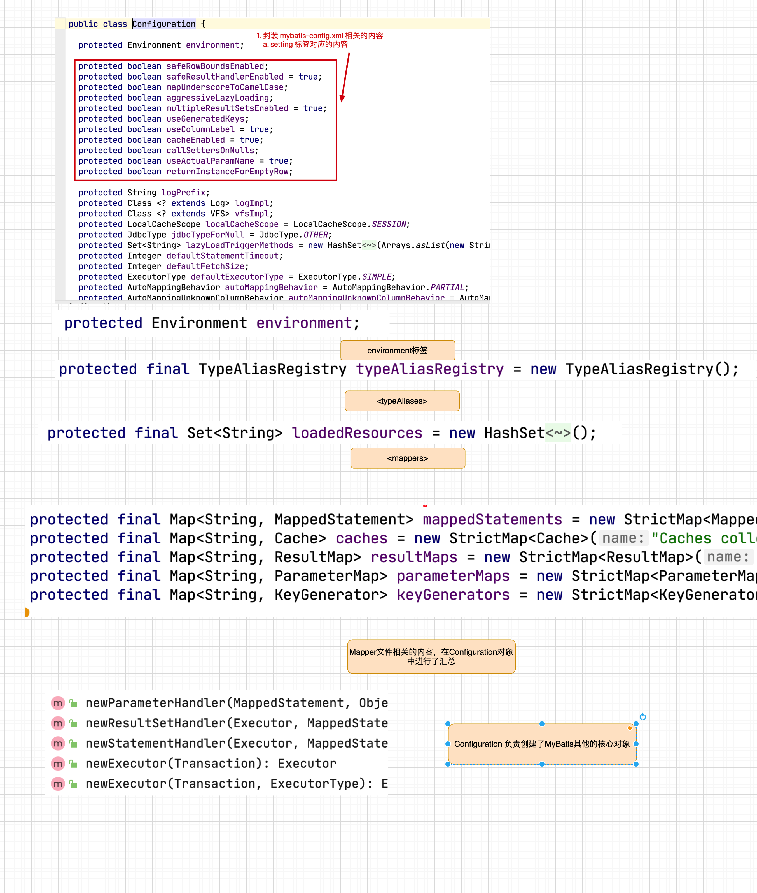
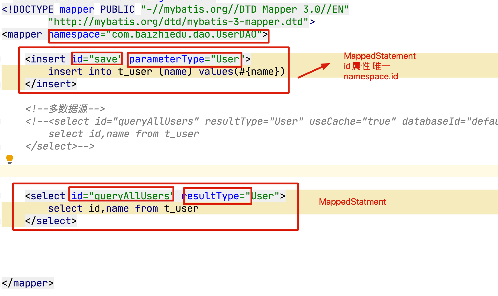

### 百知教育 — Mybatis源码分析 

---

#### 第一章、回顾

##### 1.  课程中工具的版本

~~~markdown
1. JDK8
2. IDEA2018.3
3. Maven3.5.3
4. MySQL 5.1.48 --> MySQL 5
   Mybatis 3.4.6
~~~

##### 2.  Mybatis开发的简单回顾

~~~markdown
1. Mybatis做什么？
   Mybatis是一个ORM类型框架，解决的数据库访问和操作的问题，对现有JDBC技术的封装。
2. Mybaits搭建开发环境 
   1. 准备jar
     <dependency>
        <groupId>org.mybatis</groupId>
        <artifactId>mybatis</artifactId>
        <version>3.4.6</version>
     </dependency>
     <dependency>
       <groupId>mysql</groupId>
       <artifactId>mysql-connector-java</artifactId>
       <version>5.1.48</version>
     </dependency>
   2. 准备配置文件
      a. 基本配置文件 mybatis-config.xml
         1. 数据源的设置 environments
         2. 类型别名
         3. mapper文件的注册
      b. Mapper文件
         1. DAO规定方法的实现 --> SQL语句 
   3. 初始化配置 
      mybatis-config.xml
      配置 environment
3. 开发步骤 7步
   1. entity
   2. 类型别名
   3. table 
   4. DAO接口
   5. Mapper文件
   6. Mapper文件的注册
   7. API编程 
~~~

- 核心代码分析

  ~~~java
  InputStream inputStream = Resources.getResourceAsStream("mybatis-config.xml");
  SqlSessionFactory sqlSessionFactory = new SqlSessionFactoryBuilder().build(inputStream);
  SqlSession sqlSession = sqlSessionFactory.openSession();
  
  两种方式功能等价 
  实现效果 区别 
    
  那种方式好？第一种方式好 表达概念更清晰 
            第一种开发，本质上就是对第二种开发的封装。（代理设计模式）
    
  UserDAO userDAO = sqlSession.getMapper(UserDAO.class);
  List<User> users = userDAO.queryAllUsers();
  
  List<User> users = sqlSession.selectList("com.baizhiedu.dao.UserDAO.queryAllUsers");
  
  String name = "huxz";
  
  public class User{
    private String name = "huxz";
  }
  ~~~

#### 第二章、Mybaits的核心对象

##### 1. Mybatis的核心对象及其作用

~~~markdown
1. 数据存储类对象
   概念：在Java中（JVM)对Mybatis相关的配置信息进行封装
   mybatis-config.xml ----> Configuration
   Configuration 
      1. 封装了mybatis-config.xml
      2. 封装了mapper 文件  MappedStatement
      3. 创建Mybatis其他相关的对象 
   XXXDAOMapper.xml ----> MappedStatement(形象的认知，不准确)
  操nt对象 
      对应的就是 Mapper文件中的一个一个的 配置标签 
      <select id. -----> MappedStatement
      <insert id. -----> MappedStatement 
      
      注定 一个Mybatis应用中 N个MappedStament 对象 
      MappedStatment ---> Configuration 
   
      MappedStatment 中 封装SQL语句 ---> BoundSql
2. 操作类对象 （SqlSession) ---> 门面 
    Excutor
      Excutor 是Mybatis中处理功能的核心
              1. 增删改update  查query
              2. 事务操作 
                 提交 回滚
              3. 缓存相关的操作
      Excutor接口 
           BatchExcutor
               JDBC中批处理的操作， BatchExcutor 
           ReuseExcutor
               目的：复用 Statement 
               insert into t_user（ID，name)values（1，‘孙帅’）；
               insert into t_user（ID，name)values（2，‘孙帅1’）；
           SimpleExcutor
               常用Excutor Mybatis推荐 默认 
               Configuration protected ExecutorType defaultExecutorType = ExecutorType.SIMPLE;
           
    StatmentHandler
       StatementHandler是Mybatis封装了JDBC Statement，真正Mybatis进行数据库访问操作的核心
                  功能：增删改差
       StatementHandler接口
                  SimpleStatementHandler
                      JDBC 操作 
                  PreparedStatementHandler
                  CallableStatementHandler 
    
    ParameterHandler
        目的：Mybatis参数 ---》 JDBC 相关的参数 
             @Param ---> #{} --- > ?
    ResultSetHandler
        目的：对JDBC中查询结果集 ResultSet 进行封装 
        
    TypeHandler
        Java程序操作 数据库
        Java类型   数据库类型
        String    varchar
        int       number
        int       int 
    
~~~

##### 2. Mybatis的核心对象 如何与SqlSession建立的联系？

~~~java
Mybatis源码中的这些核心对象 在 SqlSession调用对应功能时候建立联系 

SqlSession.insert()
     DefaultSqlSession
             Exctutor
                 StatmentHandler 
SqlSession.update()
SqlSession.delete()
SqlSession.selectOne();
...
  
  
底层  SqlSession.insert()
      SqlSession.update()
      SqlSession.delete()
      ....

应用层面：
    UserDAO userDAO =  SqlSession.getMapper(UserDAO.class);
    //UserDAO接口的实现类的对象 
    //疑问？ UserDAO接口实现类 在哪里？
    //动态字节码技术 ---> 类 在JVM 运行时创建 ，JVM运行结束后，消失了 
    //动态字节码技术 
          1. 如何 创建 UserDAO XXXDAO接口的实现类 
             代理 （动态代理）
             a. 为原始对象（目标）增加【额外功能】 
             b. 远程代理 1.网络通信 2.输出传输 （RPC）Dubbo 
             c. 接口实现类，我们看不见实实在在的类文件，但是运行时却能体现出来。
                无中生有
            
                Proxy.newProxyIntance(ClassLoader,Interface,InvocationHandler)
            
          2. 实现类 如何进行实现的             
             interface UserDAO{
                  List<User> queryAllUsers();         
                  save(User user)
             }
             UserDAOImpl implements UserDAO{
                 queryAllUsers(){
                     sqlSession.select("namespace.id",参数)
                        |-Excutor
                            |-StatementHandler
                                 |- ParameterHandler , ResultSetHandler
                                              TypeHandler 
                 }
                 save(){
                     sqlSession.insert("namespace.id",参数)
                 }
             }
    userDAO.queryUserById()
    userDAO.queryUsers();

MyBatis 完成代理创建 核心类型 ---> DAO接口的实现类 
     MapperProxy implements InvocationHandler 
     DAO接口Class
     SqlSession 
  
        invoke
              SqlSession.insert 
                         update
                         delete
                         selectOne
                         selectList
  
          SqlCommand:
                1. id = namespace.id
                2. type = insert|delete|select 
                          SqlSession.insert()
                          SqlSession.delete
                          ....
        
     MapperProxyFactory
         Proxy.newProxyInstrace()
~~~

