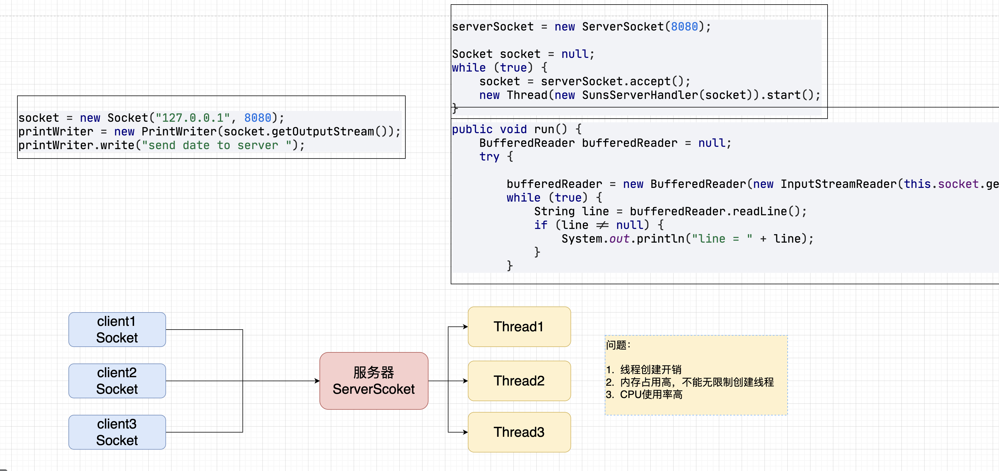
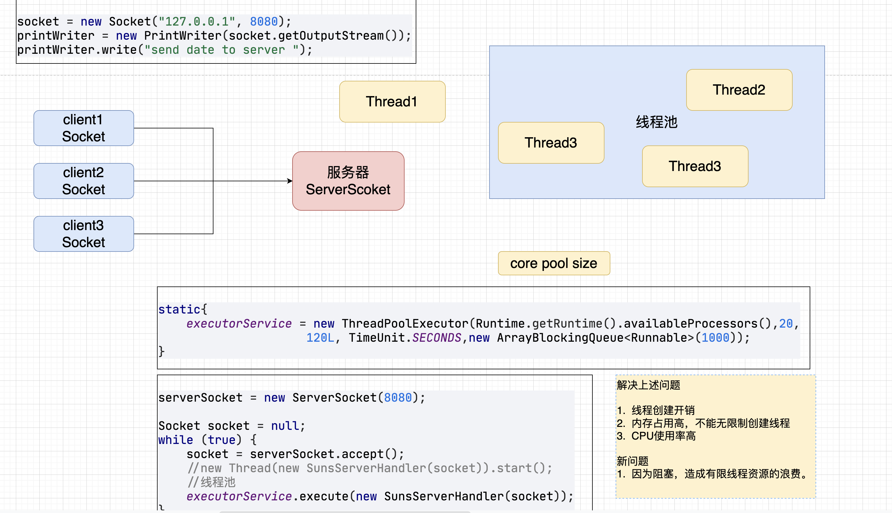
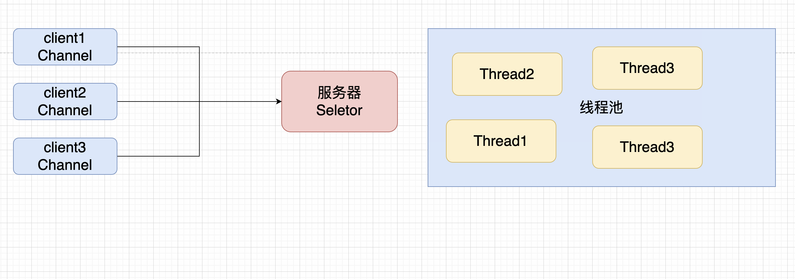
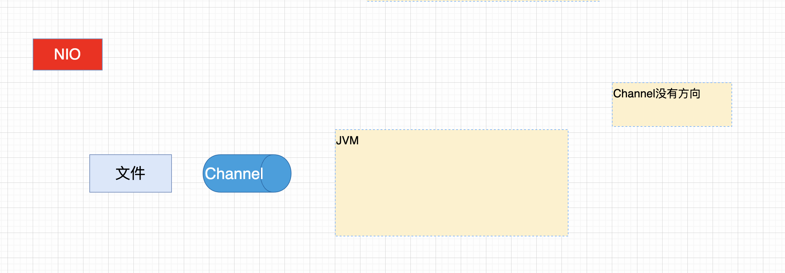
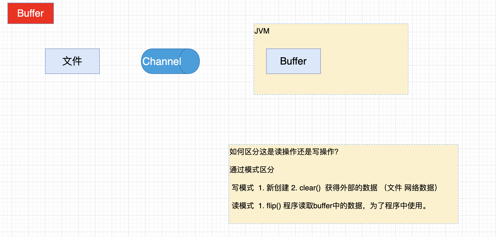
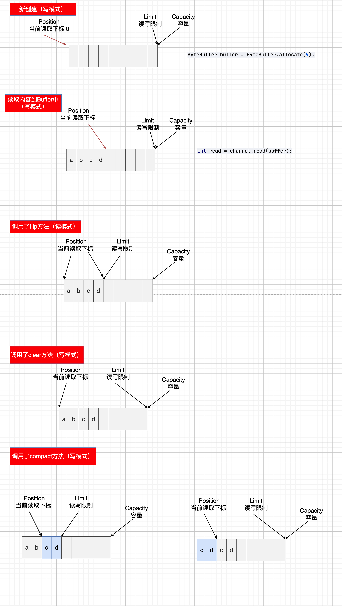
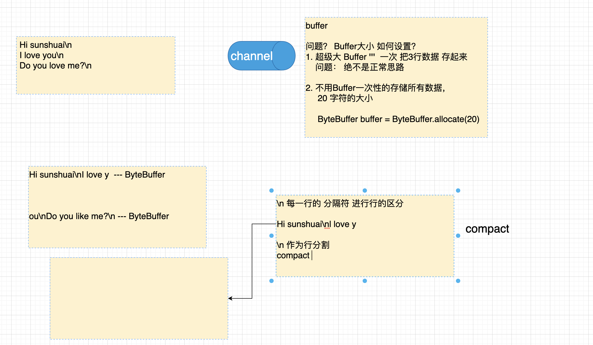
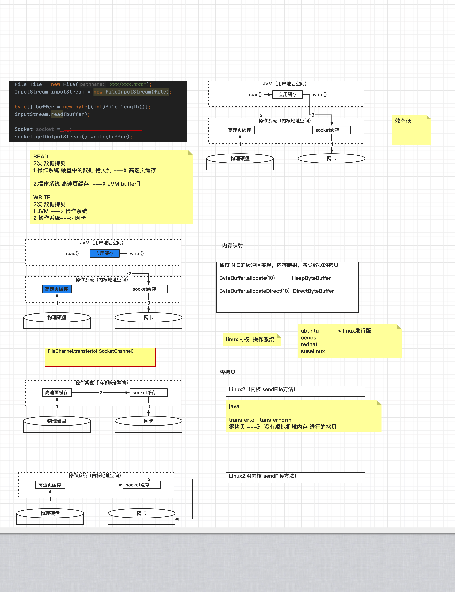

### 孙哥分布式系列课程 --- Netty应用开发

---

#### 1. 引言

##### 1.1 什么是Netty

> https://netty.io/
>
> Netty is *an asynchronous event-driven network application framework*
> for rapid development of maintainable high performance protocol servers & clients.
>
> Netty是一个异步事件驱动的网络应用框架。
> 用于快速开发可维护的高性能协议服务器和客户端。
>
> Netty is a NIO client server framework which enables quick and easy development of network applications such as protocol servers and clients. It greatly simplifies and streamlines network programming such as TCP and UDP socket server.
>
> 'Quick and easy' doesn't mean that a resulting application will suffer from a maintainability or a performance issue. Netty has been designed carefully with the experiences earned from the implementation of a lot of protocols such as FTP, SMTP, HTTP, and various binary and text-based legacy protocols. As a result, Netty has succeeded to find a way to achieve ease of development, performance, stability, and flexibility without a compromise.
>
> Netty是一个NIO客户服务器框架，它能够快速和容易地开发网络应用，如协议服务器和客户端。它大大简化和精简了网络编程，如TCP和UDP套接字服务器。
>
> 快速和简单 "并不意味着开发出来的应用程序会出现可维护性或性能问题。Netty的设计是经过精心设计的，其经验来自于许多协议的实施，如FTP、SMTP、HTTP以及各种基于二进制和文本的遗留协议。因此，Netty成功地找到了一种方法来实现开发的简易性、性能、稳定性和灵活性，而没有任何妥协。

##### 1.2 为什么要学习Netty

~~~markdown
1. Netty已经是行业内网络通信编程的标准，广泛应用于通信领域和很多其他中间件技术的底层。
 
2. 应用非常广泛
   1. 游戏行业
   2. 很多框架的通信底层，解决进程间通信。
      Spring WebFlux、storm、rocketMQ、dubbo等，是分布式系统，通信的核心。
~~~

#### 2. NIO编程

~~~markdown
1. NIO全称成为None Blocking IO (非阻塞IO)。【JDK1.4】
2. 非阻塞 主要应用在网络通信中，能够合理利用资源，提高系统的并发效率。支持高并发的系统访问。
~~~

##### 2.1 传统网络通信中的开发方式及问题

###### 2.1.1 多线程版网络编程 

###### 2.1.2 线程池版的网络编程

##### 2.2 NIO网络通信中的非阻塞编程

#### 3.NIO的基本开发方式

###### 3.1 Channel简介

~~~markdown
1. IO通信的通道，类似于InputStream、OutputStream
2. Channel没有方向性
~~~

- 常见Channel

  ~~~markdown
  1. 文件操作
     FileChannel，读写文件中的数据。
  2. 网络操作
     SocketChannel，通过TCP读写网络中的数据。
     ServerSockectChannel，监听新进来的TCP连接，像Web服务器那样。对每一个新进来的连接都会创建一个SocketChannel。
     DatagramChannel，通过UDP读写网络中的数据。
  ~~~

- 获得方式

  ~~~markdown
  1. FileInputStreanm/FileOutputStream
  2. RandomAccessFile
  
  3. Socket
  4. ServerSocket
  5. DatagramSocket
  ~~~

###### 3.2 Buffer简介

~~~markdown
1. Channel读取或者写入的数据，都要写到Buffer中，才可以被程序操作。
2. 因为Channel没有方向性，所以Buffer为了区分读写，引入了读模式、写模式进行区分。
~~~

- 常见Buffer

  ~~~markdown
  1. ByteBuffer
  2. CharBuffer
  3. DoubleBuffer
  4. FloatBuffer
  5. IntBuffer
  6. LongBuffer
  7. ShortBuffer
  8. MappedByteBuffer..
  ~~~

- 获得方式

  ~~~markdown
   1. ByteBuffer.allocate(10);
   2. encode()
  ~~~

###### 3.4 第一个NIO程序分析

~~~java
 public class TestNIO1 {
    public static void main(String[] args) throws IOException {
        //1 创建Channel通道  FileChannel
        FileChannel channel = new FileInputStream("/Users/sunshuai/Develop/code/java/idea/netty-proj-lession/netty-basic-01/data.txt").getChannel();

        //2 创建缓冲区
        //1234567890
        ByteBuffer buffer = ByteBuffer.allocate(10);

        while (true) {
            //3把通道内获取的文件数据，写入缓冲区
            int read = channel.read(buffer);

            if (read == -1) break;

            //4.程序读取buffer内容，后续的操作。设置buffer为读模式。
            buffer.flip();

            //5.循环读取缓冲区中的数据
            while (buffer.hasRemaining()) {
                byte b = buffer.get();
                System.out.println("(char)b = " + (char) b);
            }

            //6. 设置buffer的写模式
            buffer.clear();
        }
    }
}

public class TestNIO2 {
    public static void main(String[] args) {
        //RadomAccessFile 异常处理
        FileChannel channel = null;
        try {
            channel = new RandomAccessFile("/Users/sunshuai/Develop/code/java/idea/netty-proj-lession/netty-basic-01/data.txt", "rw").getChannel();

            ByteBuffer buffer = ByteBuffer.allocate(10);

            while (true) {
                int read = channel.read(buffer);
                if (read == -1) break;

                buffer.flip();
                while (buffer.hasRemaining()) {
                    byte b = buffer.get();
                    System.out.println("(char) b = " + (char) b);
                }

                buffer.clear();
            }

        } catch (Exception e) {
            e.printStackTrace();
        } finally {
            if (channel != null) {
                try {
                    channel.close();
                } catch (IOException e) {
                    throw new RuntimeException(e);
                }
            }
        }
    }
}

public class TestNIO3 {
    public static void main(String[] args) {

        try (FileChannel channel = FileChannel.open(Paths.get("/Users/sunshuai/Develop/code/java/idea/netty-proj-lession/netty-basic-01/data.txt"), StandardOpenOption.READ);) {

            ByteBuffer buffer = ByteBuffer.allocate(10);
            while (true) {
                int read = channel.read(buffer);
                if (read == -1) break;

                buffer.flip();
                while (buffer.hasRemaining()) {
                    byte b = buffer.get();
                    System.out.println("(char)b = " + (char) b);
                }

                buffer.clear();
            }

        } catch (Exception e) {
            e.printStackTrace();
        }
    } 
}

~~~

###### 3.5 NIO开发的步骤总结

~~~markdown
1. 获取Channel 
2. 创建Buffer
3. 循环的从Channel中获取数据，读入到Buffer中。进行操作.
    channel.read(buffer);

    buffer.flip();//设置读模式
    循环从buffer中获取数据。
    buffer.get();
    buffer.clear();//设置写模式
~~~

#### 4. ByteBuffer详解

##### 4.1 ByteBuffer是抽象类，他的主要实现类为

~~~markdown
1. HeapByteBuffer    堆ByteBuffer        JVM内的堆内存  --->  读写操作 效率低 会收到GC影响 
2. MappedByteBuffer(DirectByteBuffer)    OS内存        --->   读写操作 效率高 不会收到GC影响 。 不主动析构，会造成内存的泄露  
~~~

##### 4.2 获取方式

~~~markdown
 1. ByteBuffer.allocate(10);//一旦分配空间，不可以动态调整
 2. encode()
~~~

##### 4.3 核心结构

~~~markdown
ByteBuffer是一个类似数组的结构，整个结构中包含三个主要的状态
1. Capacity 
   buffer的容量，类似于数组的size
2. Position
   buffer当前缓存的下标，在读取操作时记录读到了那个位置，在写操作时记录写到了那个位置。从0开始，每读取一次，下标+1
3. Limit
   读写限制，在读操作时，设置了你能读多少字节的数据，在写操作时，设置了你还能写多少字节的数据
   
   
   
所谓的读写模式，本质上就是这几个状态的变化。主要有Position和Limit联合决定了Buffer的读写数据区域。
~~~

~~~markdown
最后总结一下
写入Buffer数据之前要设置写模式
1. 写模式
   1. 新创建的Buffer自动是写模式
   2. 调用了clear,compact方法
   
读取Buffer数据之前要设置读模式
2. 读模式
   1. 调用flip方法
~~~

##### 4.4 核心API

- buffer中写入数据[写模式  创建一个bytebuffer ,clear(),compact()]

  ~~~markdown
  1. channel的read方法
     channel.read(buffer)
  2. buffer的put方法
     buffer.put(byte)    buffer.put((byte)'a')..
     buffer.put(byte[])
  ~~~

- 从buffer中读出数据

  ~~~markdown
  1. channel的write方法
  
  2. buffer的get方法 //每调用一次get方法会影响，position的位置。
  
  3. rewind方法(手风琴)，可以将postion重置成0 ，用于复读数据。
  
  4. mark&reset方法，通过mark方法进行标记（position），通过reset方法跳回标记，从新执行.
  
  5. get(i) 方法，获取特定position上的数据，但是不会对position的位置产生影响。
  ~~~

##### 4.5 字符串操作

- # 字符串存储到Buffer中

  ~~~java
  ByteBuffer buffer = ByteBuffer.allocate(10);
  buffer.put("sunshuai".getBytes());
  
  buffer.flip();
  while (buffer.hasRemaining()) {
    System.out.println("buffer.get() = " + (char)buffer.get());
  }
  buffer.clear();
  
  
  ByteBuffer buffer = Charset.forName("UTF-8").encode("sunshuai");
  
  1、encode方法自动 把字符串按照字符集编码后，存储在ByteBuffer.
  2、自动把ByteBuffer设置成读模式，且不能手工调用flip方法。
  
  ByteBuffer buffer = StandardCharsets.UTF_8.encode("sunshuai");
  
  while (buffer.hasRemaining()) {
    System.out.println("buffer.get() = " + (char) buffer.get());
  }
  buffer.clear();
  1、encode方法自动 把字符串按照字符集编码后，存储在ByteBuffer.
  2、自动把ByteBuffer设置成读模式，且不能手工调用flip方法。
    
  ByteBuffer buffer = ByteBuffer.wrap("sunshuai".getBytes());
  while (buffer.hasRemaining()) {
    System.out.println("buffer.get() = " + (char) buffer.get());
  }
  buffer.clear();
  ~~~

- Buffer中的数据转换成字符串

  ~~~java
  ByteBuffer buffer = ByteBuffer.allocate(10);
  buffer.put("孙".getBytes());
  
  buffer.flip();
  CharBuffer result = StandardCharsets.UTF_8.decode(buffer);
  System.out.println("result.toString() = " + result.toString());
  ~~~

##### 4.6 粘包与半包

~~~markdown
1. \n 作为分割符，进行行的区分。
2. compact进行处理，把第一次没有读取完的数据，向前移动和后面的内容进行整合。
~~~

~~~java
//1. 半包 粘包
public class TestNIO10 {
    public static void main(String[] args) {
        ByteBuffer buffer = ByteBuffer.allocate(50);
        buffer.put("Hi sunshuai\nl love y".getBytes());
        doLineSplit(buffer);
        buffer.put("ou\nDo you like me?\n".getBytes());
        doLineSplit(buffer);
    }

    // ByteBuffer接受的数据 \n
    private static void doLineSplit(ByteBuffer buffer) {
        buffer.flip();
        for (int i = 0; i < buffer.limit(); i++) {
            if (buffer.get(i) == '\n') {
                int length = i + 1 - buffer.position();
                ByteBuffer target = ByteBuffer.allocate(length);
                for (int j = 0; j < length; j++) {
                    target.put(buffer.get());
                }

                //截取工作完成
                target.flip();
                System.out.println("StandardCharsets.UTF_8.decode(target).toString() = " + StandardCharsets.UTF_8.decode(target).toString());
            }
        }
        buffer.compact();
    }
}
~~~

#### 5. NIO的开发使用

##### 5.1 文件操作

###### 5.1.1 读取文件内容

~~~markdown
1. 第一个程序 读文件的内容，读Buffer---> String ---->程序中使用了
~~~

~~~java
public class TestNIO1 {
    public static void main(String[] args) throws IOException {
        //1 创建Channel通道  FileChannel
        FileChannel channel = new FileInputStream("/Users/sunshuai/Develop/code/java/idea/netty-proj-lession/netty-basic-01/data.txt").getChannel();

        //2 创建缓冲区
        //1234567890
        ByteBuffer buffer = ByteBuffer.allocate(10);

        while (true) {
            //3把通道内获取的文件数据，写入缓冲区
            int read = channel.read(buffer);

            if (read == -1) break;

            //4.程序读取buffer内容，后续的操作。设置buffer为读模式。
            buffer.flip();

            //5.循环读取缓冲区中的数据
            while (buffer.hasRemaining()) {
                byte b = buffer.get();
                System.out.println("(char)b = " + (char) b);
            }
          
            //Charset.forName("UTF-8").decode(buffer).toString ---> String

            //6. 设置buffer的写模式
            buffer.clear();
        }
    }
}
~~~

###### 5.1.2 写入文件内容

~~~java
public class TestNIO11 {
    public static void main(String[] args) throws IOException {

        //1 获得Channel  FileOutputStream, RandomAccessFile
        FileChannel channel = new FileOutputStream("data1").getChannel();

        //2 获得Buffer
        ByteBuffer buffer = Charset.forName("UTF-8").encode("sunshuai");

        //3write
        channel.write(buffer);

    }
~~~

###### 5.1.3 文件的复制

~~~java
public class TestNIO12 {
    public static void main(String[] args) throws IOException {
        //data---data2
      /*  FileInputStream inputStream = new FileInputStream("/Users/sunshuai/Develop/code/java/idea/netty-proj-lession/netty-basic-01/data.txt");
        FileOutputStream fileOutputStream = new FileOutputStream("/Users/sunshuai/Develop/code/java/idea/netty-proj-lession/netty-basic-01/data2.txt");

        byte[] buffer = new byte[1024];

        while (true) {
            int read = inputStream.read(buffer);
            if (read == -1) break;
            fileOutputStream.write(buffer, 0, read);
        }*/

       /* FileInputStream inputStream = new FileInputStream("/Users/sunshuai/Develop/code/java/idea/netty-proj-lession/netty-basic-01/data.txt");
        FileOutputStream fileOutputStream = new FileOutputStream("/Users/sunshuai/Develop/code/java/idea/netty-proj-lession/netty-basic-01/data2.txt");

        IOUtils.copy(inputStream,fileOutputStream);*/

        FileChannel from = new FileInputStream("/Users/sunshuai/Develop/code/java/idea/netty-proj-lession/netty-basic-01/data.txt").getChannel();
        FileChannel to = new FileOutputStream("/Users/sunshuai/Develop/code/java/idea/netty-proj-lession/netty-basic-01/data2.txt").getChannel();

        //传输数据上线的 2G-1
        // 若果实际文件大小就是超过2G 如何进行文件的copy
        //from.transferTo(0, from.size(), to);

        long left = from.size();
        while (left > 0) {
            left = left - from.transferTo(from.size()-left, left, to);
        }

    }
}

~~~

##### 5.2 网络编程

~~~markdown
1. 服务端 接受请求 ---》  ServerScoketChannel

2. 进行实际通信          ScoketChannel 
~~~

~~~java
通过这版代码 证明了 服务器端 存在2中阻塞
1. 连接阻塞 ---->  accept方法存在阻塞---> ServerSocketChannel阻塞。 
2. IO阻塞   ----> channel的read方法存在阻塞---> SocketChannel阻塞。
上述分析 对应着的2个问题。
public class MyServer {
    public static void main(String[] args) throws IOException {
        //1. 创建ServerScoketChannel
        ServerSocketChannel serverSocketChannel = ServerSocketChannel.open();
        //2. 设置服务端的监听端口：---》client通过网络进行访问 ip:port http://localhost:8989
        serverSocketChannel.bind(new InetSocketAddress(8000));

        List<SocketChannel> channelList = new ArrayList<>();

        ByteBuffer buffer = ByteBuffer.allocate(20);

        //3. 接受client的连接
        while (true) {
            //4. ScoketChannle 代表 服务端与Client链接的一个通道
            System.out.println("等待连接服务器...");
            SocketChannel socketChannel = serverSocketChannel.accept();//阻塞 程序等待client
            System.out.println("服务器已经连接..."+socketChannel);

            channelList.add(socketChannel);

            //5. client与服务端 通信过程 NIO代码
            for (SocketChannel channel : channelList) {
                System.out.println("开始实际的数据通信....");
                channel.read(buffer);//阻塞 对应的IO通信的阻塞
                buffer.flip();
                CharBuffer decode = Charset.forName("UTF-8").decode(buffer);
                System.out.println("decode.toString() = " + decode.toString());
                buffer.clear();
                System.out.println("通信已经结束....");

            }
        }

    }
}
~~~

~~~java
Seletor循环监听事件的方式 解决死循环空转的问题。
  public class MyServer2 {
    public static void main(String[] args) throws IOException {
        ServerSocketChannel serverSocketChannel = ServerSocketChannel.open();
        serverSocketChannel.bind(new InetSocketAddress(8000));
        serverSocketChannel.configureBlocking(false);//Selector 只有在非阻塞的情况下 才可以使用。

        //引入监管者
        Selector selector = Selector.open();//1. 工厂，2. 单例

        //监管者 管理谁？ selector.xxxx(ssc); //管理者 ssc  ---> Accept
        SelectionKey selectionKey = serverSocketChannel.register(selector, 0, null);
        // selector监控 SSC ACCEPT
        // selector
        //   keys --> HashSet
        //  register注册 ssc
        selectionKey.interestOps(SelectionKey.OP_ACCEPT);

        System.out.println("MyServler2.main");

        //监控
        while (true) {
            selector.select();//等待.只有监控到了 有实际的连接 或者 读写操作 ，才会处理。
            //对应的 有ACCEPT状态的SSC 和 READ WRITE状态的 SC 存起来
            // SelectionsKeys HashSet

            System.out.println("-------------------------");

            Iterator<SelectionKey> iterator = selector.selectedKeys().iterator();
            while (iterator.hasNext()) {//ServerSocketChannel ScoketChannel
                SelectionKey key = iterator.next();
                //用完之后 就要把他从SelectedKeys集合中删除掉。问题？ ServerScoketChannel---SelectedKeys删除 ，后续 SSC建立新的连接？
                iterator.remove();

                if (key.isAcceptable()) {
                    //serverSocketChannel.accept();
                    ServerSocketChannel channel = (ServerSocketChannel) key.channel();
                    SocketChannel sc = channel.accept();
                    sc.configureBlocking(false);
                    //监控sc状态 ---> keys
                    SelectionKey sckey = sc.register(selector, 0, null);
                    sckey.interestOps(SelectionKey.OP_READ);
                } else if (key.isReadable()) {
                    try {
                        SocketChannel sc = (SocketChannel) key.channel();
                        ByteBuffer buffer = ByteBuffer.allocate(5);
                        int read = sc.read(buffer);
                        if (read == -1) {
                            key.cancel();
                        } else {
                            buffer.flip();
                            System.out.println("Charset.defaultCharset().decode(buffer).toString() = " + Charset.defaultCharset().decode(buffer).toString());
                        }
                    } catch (IOException e) {
                        e.printStackTrace();
                        key.cancel();
                    }
                }
            }

        }

    }
}
~~~

~~~java
iterator.remove()
把用过的SelectionKey从SeletionKeys集合中剔除
~~~

~~~java
selectionKey.cancle();
把一些无法实际解决的内容，通过cancle（）来取消。避免每一次都被select()获取到从新进行循环过程。
~~~

~~~java
读取数据
1. 通过附件的形式，把byteBuffer和channel进行了绑定，从而可以多次处理数据。
2. ByteBuffer的扩容。
~~~

~~~java
数据的写出 
1. 第一个问题 写一次数据，当发现数据没有写完，设置WRITE监听状态。
2. 每一次发生Write的状态，都把剩下的数据写出去。
~~~

~~~java
主从reactor模式
  
public class ReactorBossServer {

    private static final Logger log = LoggerFactory.getLogger(ReactorBossServer.class);

    public static void main(String[] args) throws IOException, InterruptedException {
        log.debug("boss thread start ....");

        ServerSocketChannel ssc = ServerSocketChannel.open();
        ssc.configureBlocking(false);
        ssc.bind(new InetSocketAddress(8000));

        Selector selector = Selector.open();
        ssc.register(selector, SelectionKey.OP_ACCEPT);

        //模拟多线程的环境，在实际开发中，还是要使用线程池
        /*
        Worker worker = new Worker("worker1");
        */

        Worker[] workers = new Worker[2];
        for (int i = 0; i < workers.length; i++) {
            workers[i] = new Worker("worker - " + i);//worker-0 worker-1
        }

        AtomicInteger index = new AtomicInteger();

        while (true) {
            selector.select();

            Iterator<SelectionKey> iterator = selector.selectedKeys().iterator();
            while (iterator.hasNext()) {
                SelectionKey sscSelectionKey = iterator.next();
                iterator.remove();

                if (sscSelectionKey.isAcceptable()) {
                    SocketChannel sc = ssc.accept();
                    sc.configureBlocking(false);

                    //sc.register(selector, SelectionKey.OP_READ);
                    log.debug("boss invoke worker register ...");
                    //worker-0 worker-1 worker-0 worker-1
                    //hash取摸    x%2= 0  1 [0,1,0,1]
                    workers[index.getAndIncrement()% workers.length].register(sc);
                    log.debug("boss invoked worker register");
                }
            }
        }

    }
}

public class Worker implements Runnable {
    private static final Logger log = LoggerFactory.getLogger(Worker.class);
    private Selector selector;
    private Thread thread;
    private String name;

    private volatile boolean isCreated;//false

    private ConcurrentLinkedQueue<Runnable> runnables = new ConcurrentLinkedQueue<>();
    //构造方法

    //为什么不好？
    //Select Thread
    public Worker(String name) throws IOException {
        this.name = name;
       /* thread = new Thread(this, name);
        thread.start();
        selector = Selector.open();*/
    }

    //线程的任务
    public void register(SocketChannel sc) throws IOException, InterruptedException {
        log.debug("worker register invoke....");
        if (!isCreated) {
            thread = new Thread(this, name);
            thread.start();
            selector = Selector.open();
            isCreated = true;
        }
        runnables.add(() -> {
            try {
                sc.register(selector, SelectionKey.OP_READ);//reigster  select方法之前运行 。。
            } catch (ClosedChannelException e) {
                throw new RuntimeException(e);
            }
        });
        selector.wakeup();//select
    }

    @Override
    public void run() {
        while (true) {
            log.debug("worker run method invoke....");
            try {
                selector.select();

                Runnable poll = runnables.poll();
                if (poll != null) {
                    poll.run();
                }

                Iterator<SelectionKey> iterator = selector.selectedKeys().iterator();
                while (iterator.hasNext()) {
                    SelectionKey sckey = iterator.next();
                    iterator.remove();

                    if (sckey.isReadable()) {
                        SocketChannel sc = (SocketChannel) sckey.channel();
                        ByteBuffer buffer = ByteBuffer.allocate(30);
                        sc.read(buffer);
                        buffer.flip();
                        String result = Charset.defaultCharset().decode(buffer).toString();
                        System.out.println("result = " + result);
                    }

                }
            } catch (IOException e) {
                throw new RuntimeException(e);
            }

        }
    }
}

~~~

##### 5.3 零拷贝的问题

~~~markdown
1. 什么是零拷贝 【概念】
~~~

