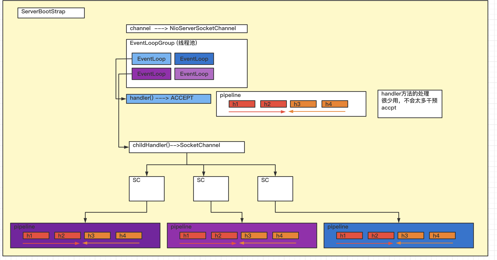
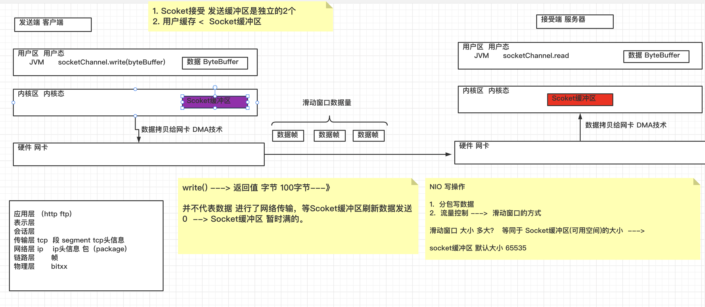

### 孙哥分布式系列课程 --- Netty应用开发

---

#### 1. 引言

##### 1.1 什么是Netty

> https://netty.io/
>
> Netty is *an asynchronous event-driven network application framework*
> for rapid development of maintainable high performance protocol servers & clients.
>
> Netty是一个异步事件驱动的网络应用框架。
> 用于快速开发可维护的高性能协议服务器和客户端。
>
> Netty is a NIO client server framework which enables quick and easy development of network applications such as protocol servers and clients. It greatly simplifies and streamlines network programming such as TCP and UDP socket server.
>
> 'Quick and easy' doesn't mean that a resulting application will suffer from a maintainability or a performance issue. Netty has been designed carefully with the experiences earned from the implementation of a lot of protocols such as FTP, SMTP, HTTP, and various binary and text-based legacy protocols. As a result, Netty has succeeded to find a way to achieve ease of development, performance, stability, and flexibility without a compromise.
>
> Netty是一个NIO客户服务器框架，它能够快速和容易地开发网络应用，如协议服务器和客户端。它大大简化和精简了网络编程，如TCP和UDP套接字服务器。
>
> 快速和简单 "并不意味着开发出来的应用程序会出现可维护性或性能问题。Netty的设计是经过精心设计的，其经验来自于许多协议的实施，如FTP、SMTP、HTTP以及各种基于二进制和文本的遗留协议。因此，Netty成功地找到了一种方法来实现开发的简易性、性能、稳定性和灵活性，而没有任何妥协。

##### 1.2为什么需要使用Netty

~~~markdown
1. Netty是完成网络通信的框架，底层封装了NIO
2. NIO存在很多问题
   API 复杂难用，尤其是 Buffer 的指针切来切去的 [ByteBuf]
   需要掌握丰富的知识，比如多线程和网络编程
   可靠性无法保证，断线重连、半包粘包、网络拥塞统统需要自己考虑
   空轮询 bug，CPU 又 100% 
~~~

##### 1.3 Netty的发展历程

~~~markdown
1. Trustin Lee 2004年开发了Netty，成功入职了Arreo通信公司
2. 2008年，Trustin Lee，加入JBoss，发布了Netty3
3. 2012年，Trustin Lee，单干，发布了Netty4
4. 2013年，发布了Netty5。 引入JDK的新特性，比如 ForkJoinPool等
   使用 ForkJoinPool 提升了复杂性
   没有带来明显的性能提升
   同时维护太多分支太耗费精力
~~~

##### 1.4 谁在用Netty 

~~~markdown
1. 框架，gRPC、Dubbo、Spring WebFlux、Spring Cloud Gateway
2. 大数据，Spark、Hadoop、Flink
3. 消息队列，RocketMQ、ActiveMQ
4. 搜索引擎，Elasticsearch
5. 分布式协调器，Zookeeper
6. 数据库，Cassandra、Neo4j
7. 负载均衡，Ribbon
~~~

#### Netty的第一个应用

##### 1. 环境搭建

~~~xml
<dependency>
  <groupId>io.netty</groupId>
  <artifactId>netty-all</artifactId>
  <version>4.1.45.Final</version>
</dependency>

<dependency>
  <groupId>junit</groupId>
  <artifactId>junit</artifactId>
  <version>4.13.2</version>
  <scope>test</scope>
</dependency>

<dependency>
  <groupId>org.slf4j</groupId>
  <artifactId>slf4j-api</artifactId>
  <version>1.7.32</version>
</dependency>

<dependency>
  <groupId>ch.qos.logback</groupId>
  <artifactId>logback-classic</artifactId>
  <version>1.2.9</version>
</dependency>
~~~

##### 2. 第一个程序分析 [NIO]

~~~java
public class MyNettyServer {
    public static void main(String[] args) {
        ServerBootstrap serverBootstrap = new ServerBootstrap();

        serverBootstrap.channel(NioServerSocketChannel.class);

        //创建了一组线程 通过死循环 监控状态 accept read write
        serverBootstrap.group(new NioEventLoopGroup());

        //ServerSocketChannel  SocketChannel
        serverBootstrap.childHandler(new ChannelInitializer<NioSocketChannel>() {
            @Override
            /*
                 channel 接通 监控 accept rw 处理 通过流水线 用handler进行处理 。
             */
            protected void initChannel(NioSocketChannel ch) throws Exception {
                //ByteBuf 字节--->字符
                //ch.pipeline().addLast(new StringDecoder());
                ch.pipeline().addLast(new ChannelInboundHandlerAdapter() {
                    @Override
                    public void channelRead(ChannelHandlerContext ctx, Object msg) throws Exception {
                        ByteBuf buffer = (ByteBuf) msg;
                        String result = ((ByteBuf) msg).toString(Charset.defaultCharset());
                        System.out.println("result = " + result);
                    }
                });
            }
        });

        serverBootstrap.bind(8000);

    }

}

public class MyNettyClient {
    public static void main(String[] args) throws InterruptedException {
        Bootstrap bootstrap = new Bootstrap();

        bootstrap.channel(NioSocketChannel.class);

        // 为什么client 引入事件 循环 组
        // client Netty 做多线程 异步
        // 连接服务端 一个线程
        // 通信 做成一个线程
        // 异步处理  连接 --->
        //          IO操作
        bootstrap.group(new NioEventLoopGroup());

        bootstrap.handler(new ChannelInitializer<NioSocketChannel>() {
            @Override
            protected void initChannel(NioSocketChannel ch) throws Exception {
                ch.pipeline().addLast(new StringEncoder());
            }
        });

        ChannelFuture connect = bootstrap.connect(new InetSocketAddress(8000));
        connect.sync();
        //创建了新的线程 进行写操作
        Channel channel = connect.channel();
        channel.writeAndFlush("hello suns");

    }
}
~~~

##### EventLoop

~~~markdown
1. 事件（Accept READ WRITE） 循环(死循环)
2. 曾经讲过的worker 
   1. 独立线程
   2. 通过死循环 监控 状态 进行操作 --》 run
      while(true){
         selector.select
         
         SelectionKeys 遍历
      }
   3. Selector
   
EventLoop     worker 线程 select ---> READ WRITE 
              boss   线程 select ---> Accept
              
开发中 如何过的EventLoop 
1. 不会通过构造方法 让程序员创建。
2. 通过EventLoopGroup创建
~~~

##### EventLoopGroup 

~~~markdown
1. 编程的过程中，开放的编程接口 EventLoopGroup
2. EventLoopGroup 创建EventLoop(一个线程) 多个EventLoop(多个线程)
                  管理EventLoop  
                  
                  EventLoopGroup EventLoop的工厂
~~~

##### NioEventLoop和DefaultEventLoop区别

~~~markdown
1. NioEventLoop 是一个线程  IO Write Read 事件监控
2. DefaultEventLooop 就是一个普通的线程，内容工作可以由程序员决定，他不做 IO监控 读写的处理.

注意：后续再Netty进行多线程开发，推荐大家优先考虑DefaultEventLoop -->普通线程。
~~~

##### 注意：

~~~markdown
1. EventLoop是会绑定channel，EventLoop可以支持多个channel访问的。
2. 服务端 进行EventLoop的分工 --->  主从Reactor模式（NIO,Netty...)
3. DefaultEventLoop，辅助NIOEventLoop完成 普通业务操作。
~~~

##### 异步

~~~markdown
处理过程中 
1. 阻塞 主线程 完成异步操作的配合。
   future.sync();
2. 异步处理 （新线程 异步线程完成的）
    future.addListener(new ChannelFutureListener() {
      @Override
      public void operationComplete(ChannelFuture future) throws Exception {
      log1.debug(" add Listerner .....");
      Channel channel = future.channel();
      channel.writeAndFlush("hello suns");
    }
    });
    
只要是异步的操作 只能通过上述的2种方式的一种处理。
在Netty只要涉及到 网络 IO的相关操作 那么Netty都会涉及异步处理。

.connect() netty 异步   
.writeAndFlush   异步
.close()         异步 

Netty为什么 要把 网络 IO的相关操作 做成异步？
异步的好处？
1.提高系统的吞吐量。。。
2.效率上的提高 绝不是 1+1=2
                   1+1 = 1.5
~~~

##### Netty中异步设计 （内部原理）

~~~markdown
JDK   Future
Netty Future
Netty Promise
~~~

##### Channel

~~~markdown
1. JDK ServerSocketChannel  SocketChannel
2. Netty原有JDK中channel进行 统一的封装。
   1. 统一channel的编程模型，通过他的封装 不在让客户区分SocketChannel ServerSocketChannel
   2. Netty 一旦封装了Channel，更好的和Netty框架结合起来。 I/0  pipeline ,配置 Channel TCP Socket缓冲区 滑动窗口的大小。。 
~~~

~~~markdown
1. Netty封装Channel 提供哪些API (方法)
   channel.writeAndFlush("xiaohei"); 
          .write
          
   writeAndFlush 写出数据后 刷新缓冲区 ---》 写出去了
   write不会立即发出去的，存在缓冲区中，手工.flush.
   
   .close() 顾名思义 作用 channel.close() ---> Socket 
    ChannelFuture close = channel.close();//异步化操作 启动一个新的线程
         //其他资源的释放，其他事，close()方法执行完之后，运行后面这些代码
        //main主线程完成
        //close.sync();

    close.addListener(new ChannelFutureListener() {
      @Override
      public void operationComplete(ChannelFuture future) throws Exception {
      log.debug("channel.close()执行完后，操作后续的一些工作...");//不行
      }
    });
    
    eventLoopGroup.shutdownGracefully();

2. 如何封装的Channel(源码)
~~~

##### Handler[重要 程序员编程]

~~~markdown
1. Handler作用，用于处理接受 或者发送前的数据。程序员使用netty最重要的战斗场地
2. 通过Pipeline 把多个handler有机整合成了一个整体。
   读取数据   ChannleInboundHandler  子类
   写出数据   ChannelOutboundHandler 子类 
3. Pipleline中 执行Handler有固定顺序 （类似一个栈）双向链表
4. Handler传递数据 
     super.channelRead(ctx, msg);
     最后一个Handler不需要传递数据时，那么上述方法 也就无需调用。
     底层 ctx.fireChannelRead(s);
5. 最后一个handler如果不需要传递数据了
   无需调用 
    super.channelRead(ctx, msg);
    ctx.fireChannelRead(s);
6. Head Tail 2个默认的Handler在Pipeline
   head --> handler1 ---> StingDecoder ---> handler2 ---> handler3 --> tail 
  
7. OutboundHandler 特性 编码顺序 和 运行顺序 相反 

8. 同一种Handler的编码顺序 和 运行顺序 相关 。 h1 h2 h3
                                          h1 h3 h2    
                                          
   不同种的Handler，顺序有所不同，不会影响运行效果。
   
9. 注意
   ch.writeAndFlush("hello  suns");
   全局的查找输出OutboundHandler 依次运行 
   ctx.writeAndFlush("hello xiaojr");
   从当前Handler，往前查找，没有输出的OutboundHandler。
   
10. 方便测试Handller
    EmbeddedChannel
~~~

##### ByteBuf

~~~markdown
1. 类似NIO ByteBuffer --- Netty网络通信的过程中，底层数据存储ByteBuf。

2. ByteBuf --> ByteBuffer封装
   1. 自动扩容
   2. 读写的指针，方便操作。  ByteBuffer没有读写指针的。读模式.flip 写模式 clear compact() 
   3. 内存的池化。（连接池，线程池）
   4. 0copy相关内容。netty 0copy 尽可能少占用内存。
~~~

##### ByteBuf的基础使用

~~~java
1. //如何获得ByteBuf 1. 支持自动扩容 2. 制定byteBuf初始化大小 3.256 3. 最大值 Integer.max,在构造方法中指定最大值
   ByteBuf buffer = ByteBufAllocator.DEFAULT.buffer(10);

2.自动扩容 什么规律？ 扩充到最大的ByteBuf的值
  4的n次方 ---> 4 二次方 16  4 三次方 64 ---> 原有数据*2
~~~

##### ByteBuf与内存关系

~~~markdown
1. 堆内存
      创建和销毁 代价小。读写效率（低），GC压力大
2. 直接内存
      创建和销毁 代价大。GC压力小。
3. 引入了ByteBuf池化思想
   1. 站在调用者提高创建的效率。
   2. 合理的使用了资源  —>  jemalloc
   3. 减少内存溢出的可能 （内存不够用，内存使用过多）
   
4. Netty池化默认开启的
   4.1以后 ByteBuf池化 
   4.1以前 关闭
   -Dio.netty.allocator.type=pooled unpooled
~~~

##### ByteBuf内存结构

~~~markdown
1. ByteBuffer 读写模式切换 。 clear() compact()   flip()

2. 读写指针 
~~~

##### ByteBuf内存释放

~~~markdown
1. 是不是回收，清空？销毁？
   不是，如果ByteBuf池化的，内存释放。---》放回byteBuf的池子。
   及使不是ByteBuf池化的 释放，不一定立即销毁。堆内存，垃圾回收。
2. Netty在处理内存释放时，因为内存释放情况种类繁多，所以netty对于编程人员来讲，设计了统一的内存释放接口。

3. RefrenceCounted(引用计数器)--》
   ByteBuf

    创建一个ByteBuf  —> 1

    ByteBuf —> retain +1

    ByteBuf —> release -1 …0
    
 4. ByteBuf什么时候需要释放？
    1. ByteBuf一定只能应用在pipeline中，在handler中进行释放数据最为理想且稳妥。
    
    2. tailContext 会对读到的数据进行ByteBuf释放。
       headContext 会对写的数据进行ByteBuf的释放。
       
       最后一次程序员在handler中使用ByteBuf时候，做ByteBuf释放。
~~~

##### API

~~~java
分片 slice
~~~

##### 半包粘包 （黏包）

~~~java
1. 半包粘包
   本质 接受数据时，数据有可能接受不完整，也可能接受过多。
~~~

~~~markdown
1. 网络通信过程中，什么情况可以导致接受数据不完整或者过多？
   1. ByteBuf
~~~

~~~markdown
1. Netty通信过程中，用于网络通信的ByteBuf是Netty创建。
   1. 如何获得？
      Handler 第一个非head得inboundhandler 获得 参数 就是Netty读取数据后，封装ByteBuf。
   2. Netty创建的ByteBuf默认大小多大？
      接受数据所创建的ByteBuf 大小默认 1024  
~~~

##### Netty半包粘包的解决方式 思路分析

~~~markdown
1. ByteBuf--->handler--->第一个非head得handler

2. decoder|encoder  ---> 原始字节 Byte ---> Message[半包 粘包 都解决完成了]

3. ByteToMessageDecoder 完成 ByteBuf ---> Message(完整的消息 不应该半包粘包)

解决半包粘包的方式 
1. FixedLengthFrameDecoder 固定长度的解码器 
   解决的问题是 固定长度消息的 半包粘包问题。  
   新问题 10
   client ---> abc_________
   
   不好的地方 占用空间 
   
2. LineBasedFrameDecoder  要求你每一个完成的消息必须有个分割符 \n \r\n
   DelimiterBasedFrameDecoder 自定义分割符
   
3. LengthFieldBasedFrameDecoder
   lengthFieldOffset  从第几个字节开始找 length 位
   lengthFieldLength length位的长度
   lengthAdjustment length位后面第几个字节是内容
   initailByteToStrip  去头 
~~~

#### 编解码器 （Codec）

##### 1. 什么是编解码

~~~markdown
1. 编码  Java对象 ---》 二进制 （Byte)
2. 解码  二进制   ---》 Java对象 

广义编解码 （codec) 2部分
1. encode  Java对象 ---》 二进制 （Byte)
2. decode  二进制   ---》 Java对象 
~~~

~~~markdown
Netty中编解码的体现 
1. 
   1. encode  Java对象 ---》 二进制 （Byte)
   2. decode  二进制   ---》 Java对象 
   
2. Netty中编解码工作 谁做的呢？
   Handler --> ChannelHandler 
   
   ByteToMessageCodec 
   ByteToMessageDecoder  --- 实际开发解码器 就作为这个类型的子类 
   MessageToByteEncoder  --- 实际开发编码器 就作为这个类型的子类 
  
3. 编解码器 在使用过程中 2部分核心内容
   1. 序列化协议（编码格式）（传输数据的格式）
      1. java序列化 和 反序列化 
         1. 类 implements Seriliazable接口 （标识性接口）接口里面没有方法 实现的 Spring ThrowsAdvice
         2. ObjectOutputStream ---> Java 转换成 二进制的内容 ---> 文件|通过网络进行传输 
            ObjectInputStream  ---> 二进制的内容 转换成 Java 
         3. serialVersionUID private static final long 
            1. serialVersionUID --> 如果不显示创建 java在序列化的过程中会不会创建？默认创建的 hashCode 
         
         问题：
            1. 无法跨语言的
            2. 可读性差 ---> 二进制
            3. java序列化后的数据大小 大 ---》 ByteBuffer 5倍 传输效率 低
            4. java序列化操作的时间 ---》ByteBuffer 5倍
   
      2. XML
            c   --------------------------------------------  s
            <user>
               <id>1</id>
               <name>sunshuai</name>
            </user>
            
      3. JSON
           可读性好 {"name":"sunshuai","age":10},数据量 > 二进制的内容。 HTTP协议 + JSON ->SpringCloud
           
      4. msgpack
          类似于JSON,二进制传输。效率高 数据体量小 ---》支持多语言的  【bson ---> mongodb】4倍与protobuf
          
      5. protobuf google
         二进制 支持多种编程语言 -> 自己的编译器，把数据格式编译成中间语言 ---> go python.. 更小 更快 可读性差。
         Hadoop  
       
   2. 具体的编解码器 
       ByteToMessageDecoder  --- 实际开发解码器 就作为这个类型的子类 
       MessageToByteEncoder  --- 实际开发编码器 就作为这个类型的子类 
~~~

##### Netty常见的编解码器 

~~~markdown
1. StringDecoder StringEncoder
功能 --- String转换 
注意：
   Netty的编解码体系中 
   1. ByteToMessage
      MessageToByte
      
      MessageToMessageDecoder
      MessageToMessageEncoder
      
   2. 区别
      1. Byte系列的编解码 更底层
         decode方法参数 观察到的
         
      2. ByteToMessage体系 
         解决封帧的问题 （半包 粘包）
         
         MessageToMessage不自己解决。
         FixedLengthFrameDecoder
         LineBasedFrameDecoder 
         LengthFieldBasedFrameDecoder
         
2. 封帧相关的
   FixedLengthFrameDecoder
   LineBasedFrameDecoder 
   LengthFieldBasedFrameDecoder
   
3. Java序列化相关的编解码
    ObjectEncoder  
    
    ObjectDecoder()  LengthFieldBasedFrameDecoder子类 不会有半包粘包
    
    编解码器 Netty。做了一定的优化，数据小 ---> 幻术 

4. JSON相关的编解码器
   Netty JSON编码器(String ---> ) 只提供了JSON解码器 JsonObjectDecoder
   针对于JSON数据 做封帧的（半包 粘包)
   
5. Http协议编解码操作 
   Netty支持对Http协议进行编解码 ---》 Netty可以作为Web服务器 ---》 SpringWebFlex 底层就是基于Netty. --->Gateway
   
   1. HttpServerCodec()
   2. HttpObject子类进行编程了。
   
   
   1. pipeline的调用与 Message的个事相关
   2. 可以通过SimpleChannelInboundHandler限定消息的类型
   3. channelRead0 和 channelRead区别是什么？
      channelRead底层调用channelRead0
      在channelRead中已经对于msg做了类型的转换。
   4. HttpObjectAggregator
      HttpRequest 和 HttpContent 聚合在一起。
      
   5. Http协议的解码器，会出现半包粘包问题么？
      Http协议Content-Length ---> 数据 不会出现。
~~~

##### 自定义编解码器 

~~~markdown
1. 编码器  
   extends MessageToByteEncoder
   encode
 
2. 编码器
   extends ByteToMessageDecoder
   1. 如果ByteBuf的数据一次解码没有处理完成，则Netty会重复调用decode方法
   
3. extends ByteToMessageCodec
   编解码器 合二为一
   
4. Netty提供的一个特殊的解码器 ReplayingDecoder
   他的实现类 中的decode方法 不需要做任何安全设置。
   
   Netty编程 
     1. Bytebuf读写指针 
     2. Bytebuf释放 
~~~

##### 自定义系统的通信协议

~~~markdown
1. 设计协议   
   client 与 服务器端 传输数据的格式 
   协议头 
      幻数（魔术）suns版本号 
      指令类型  登录 注册 xxx 业务操作的编号
      序列化的方式：1 json 2 protobuf 3 hession
      正文长度
   协议正文（协议体）消息正文 
      {name:"sunshuai",password:"xiaohei"}
      
2. 编解码
    参看代码 
~~~

#### ChannelHandler总结

~~~markdown
1. Handler作用：
   1. 网络连接（Channel)已经建立，通过Handler IO相关的操作。 处理IO中的数据。ChannelHandler是Netty中最为重要的一个组件。与开发息息相关。
 
2. Pipeline中Handler执行流程？
   1. Pipleine底层数据结构 双向列表 输入（入栈） 输出（出栈） 
   2. Pipeline中
       head ChannelInitializer  hander1 hander2 hander3..      tail
       
3. channel.writeAndFlush 与 ChannelHandlerContext.writeAndFlush()区别
   1. channel.writeAndFlush 从整个pipeline的最后一个输出的handler(OutboundHandler)开始依次执行OutboundHandler
   2. channelHandlerContext.writeAndFlush() 从当前位置依次查找前面的OutBoundHandler进行依次执行。
   
4. ByteBuf的使用和释放
    //不建议使用 
      ByteBuf byteBuf = ByteBufAllocator.DEFAULT.buffer();
    //建议
      ctx.alloc().buffer();
      
      ByteBuf用完后一定 realase() 
      
 5. channel的生命周期方法 或者 ChannelHandler中回调
 
    SocketChannel IO操作  不负责accpet
 
 
    initchannel
    0. addHandler 
    
    1.channelRegistered  
        当连接（Channel)被分配到了具体的worker线程上，回调这个方法。
        
        问题：有没有可能Channel被accept但是没有分配worker？
        答 存在这个可能性，client并发多与worker的数量。
    

    
   2. channelActive 【常用】
        channel的准备工作基本完成了。所有的pipeline上面的handler添加完成。 channel准备就绪了。
        channelActive方法被回调用，就因为这个client和服务端 可以进行通信了。
        
        应用过程中，可以通过channelActive回调，像另一方写数据
        
        
   3.channelRead【常用】
        接受数据操作，每一次发过来数据都会回调这个方法。
    
   4. channelReadComplete
       读操作结束。目的 资源性的释放，类似于finally
    
    
    下面的2个方法 ，都会在channel关闭的时候 调用
    
    服务端调用close,则直接回调 后面的2个方法
    客户端调用close方法，发送消息到服务端。
    
  5.channelInactive
      channel连接断掉，TCP连接没有了
      
  6.channelUnregistered
      对应分配给我们的worker线程 换回 EventLoopGroup 
      
  7. removeHandler
  
  为什么了解回调 ---Channel相关一些事件 。Netty (基于事件的异步通信框架)
  
6. 异常的处理
   exceptionCaught
     如果本handler出现的异常 这个方法可以处理
     如果本handler中前面handler出现的未处理异常，他也可以处理。
   开发的过程中 一定要设置日志，没有日志，无法挑错。
   
  
7. Handler相关内容

~~~

##### IdleStateHandler

~~~markdown
作用：空闲检查 
1. 注意： 常用于服务端监控的一个Handler
         读空闲 ，写空闲 ，读写空闲 （空闲指的就是没有通信）
         
开发场景： 
   心跳 :  在一段时间内 读写都空闲 更能说明，网络有可能不同。
           读写空闲
           
           
   注意： 1. 心跳检测是二种方式：
            1. IdleStateHandler 方式 空闲时间 最够长 死了 一次性处理。
            2. 一定的时间间隔 一定次数 死 
   
         2. 监控到了空闲之后，核心关闭channel。完成业务处理的善后工作。 
         
         3. 客户端角度：如果发现 channel关了，但是client本身没事，重试的机制。
            定时任务。
~~~

##### WebSocketServerProtocalHandler

~~~markdown
1. 增加 Netty处理WebSocket能力..

常规的问题 
    1. WebSocket干什么？
    协议：全双工的
    
    传统的Http1.0协议  短连接协议， 请求 《---》 响应 结束 连接（断了） 无状态协议 （用户会话追踪，cookie --> session）
    传统的Http1.1协议  有限的长连接 目的 减少tcp 连接 握手的次数 keepalive 决定连接的时长
    HTTP 持久性连接（也称为HTTP keep-alive或HTTP 连接重复使用）是一种概念，允许单个TCP 连接发送和接收多个HTTP 请求/响应，而不是为每个请  求/响应对打开新连接。 Apigee 使用持久性连接与后端服务进行通信。 默认情况下，连接保持活动状态60 秒。
    
    不能做推送 服务端 推数据
    
    服务器端 发生变化了 主动告知 client
    
    2. WebSocket协议 Http协议关系是什么？
       WebSocket在Http协议之上的。
    
    3. Netty如何支持WebScoket
       WebSocketServerProtocalHandler 
~~~

##### Shareable [可以共享的Handler]

~~~markdown
多个Pipeline中共用Handler的方式 

1. 不要在pipeline中new Handler,把new Handler的过程提取到外面，这样多个Pipeline就可以共用Handler.
2. 如果共用Handler就意味着 Handler会被多线程访问。

Handler处理过程中 什么情况下可以被多个pipeline共用 

1. 无状态的Handler 或者  有状态但是 加锁 Handler 可以被Pipeline共用。
2. MessageToMessasgeDcoder 也可共用。能被共用的Handler 会通过一个 注解生命 @Sharable.
3. ByteToMessageDecoder 及其子类  不能。

注意：
   开发能被共用的@Sharable ,不能被共用的不加@Sharable(ByteToMessageDecoder)
   能加的就提取出来共用，不能加的就Pipeline 去创建了。
   
开发建议：
   自定义的过程中，Handler处理成无状态 （没有成员变量），可以使用Sharable。
~~~

##### 规范化Netty的开发

~~~java
package com.suns.netty14;

import com.fasterxml.jackson.core.JsonProcessingException;
import io.netty.bootstrap.Bootstrap;
import io.netty.channel.*;
import io.netty.channel.nio.NioEventLoopGroup;
import io.netty.channel.socket.nio.NioSocketChannel;
import io.netty.handler.codec.string.StringEncoder;
import io.netty.handler.logging.LoggingHandler;
import org.slf4j.Logger;
import org.slf4j.LoggerFactory;

import java.net.InetSocketAddress;

// channel 什么关闭？
// handler一些回调方法进行处理
// IdleStateHandler处理 关闭channel
// 异常发生 也会关闭channel
// 程序正常退出 。。

// 写内容 都要在Handler中完成。

public class MyNettyClient {
    private static final Logger log = LoggerFactory.getLogger(MyNettyClient.class);

    public static void main(String[] args) throws InterruptedException, JsonProcessingException {

        EventLoopGroup eventLoopGroup = new NioEventLoopGroup();
        LoggingHandler loggingHandler = new LoggingHandler();
        StringEncoder stringEncoder = new StringEncoder();
        try {
            Bootstrap bootstrap = new Bootstrap();
            bootstrap.channel(NioSocketChannel.class);
            Bootstrap group = bootstrap.group(eventLoopGroup);
            bootstrap.handler(new ChannelInitializer<NioSocketChannel>() {
                @Override
                protected void initChannel(NioSocketChannel ch) throws Exception {
                    ch.pipeline().addLast("logging", loggingHandler);
                    ch.pipeline().addLast("stringEnoder", stringEncoder);
                    ch.pipeline().addLast(new ChannelInboundHandlerAdapter() {
                        @Override
                        public void channelActive(ChannelHandlerContext ctx) throws Exception {
                            ctx.writeAndFlush("xiaohei");
                        }
                    });
                }
            });
            Channel channel = bootstrap.connect(new InetSocketAddress(8000)).sync().channel();
            //监控channel的关闭
            channel.closeFuture().sync();
        } catch (InterruptedException e) {
            log.error("client error ", e);
        } finally {
            eventLoopGroup.shutdownGracefully();
        }

    }
}

package com.suns.netty14;

import io.netty.bootstrap.ServerBootstrap;
import io.netty.channel.Channel;
import io.netty.channel.ChannelInitializer;
import io.netty.channel.ChannelPipeline;
import io.netty.channel.EventLoopGroup;
import io.netty.channel.nio.NioEventLoopGroup;
import io.netty.channel.socket.nio.NioServerSocketChannel;
import io.netty.channel.socket.nio.NioSocketChannel;
import io.netty.handler.logging.LoggingHandler;
import org.slf4j.Logger;
import org.slf4j.LoggerFactory;

public class MyNettyServer {

    private static final Logger log = LoggerFactory.getLogger(MyNettyServer.class);

    public static void main(String[] args) {
        LoggingHandler loggingHandler = new LoggingHandler();
        EventLoopGroup bossGroup = new NioEventLoopGroup(1);
        //workerGroup默认 后续结合内存的压力进行调整。
        EventLoopGroup workerGroup = new NioEventLoopGroup();

        try {
            ServerBootstrap serverBootstrap = new ServerBootstrap();
            serverBootstrap.channel(NioServerSocketChannel.class);
            serverBootstrap.group(bossGroup, workerGroup);
            serverBootstrap.childHandler(new ChannelInitializer<NioSocketChannel>() {
                @Override
                protected void initChannel(NioSocketChannel ch) throws Exception {
                    ChannelPipeline pipeline = ch.pipeline();
                    pipeline.addLast(loggingHandler);
                    //共用的独立的使用 ，不能共用的自己创建
                }
            });
            Channel channel = serverBootstrap.bind(8000).sync().channel();
            channel.closeFuture().sync();
        } catch (Exception e) {
            log.error("server error", e);
        } finally {
            bossGroup.shutdownGracefully();
            workerGroup.shutdownGracefully();
        }
    }
}

~~~

#### Netty相关的参数

~~~markdown
1. netty参数的设置位置

client
  bootstrap.option()

server
  serverBootstrap.option();      //ServerScoketChannel
  serverBootstrap.childOption()  //ScoketChannel

2. netty中 

ChannelOption（ChannelOption进行配置修改） --- ChannelConfig(核心配置) ---DefaltChannelConfig（核心配置的默认值）

ChannelOption.XXXX,对应内容
~~~

~~~markdown
1. RCVBUF_ALLOCATOR  SocketChannel  
作用：设置服务端 ByteBuf缓冲区大小,这个IO ByteBuf在netty设计中，只能是直接内存。

默认值：
   最小64 初始值1024 最大65535

主动设置
  serverBootstrap.childOption(ChannelOption.RCVBUF_ALLOCATOR, new AdaptiveRecvByteBufAllocator(16,16,16));
  
2. SO_RCVBUF &  SO_SNDBUF [了解即可]
 *SO_RCVBUF ServerSocketChannl  option() 接受Socket缓冲区的大小 。
 SO_SNDBUF SocketChannel       客户端 option()  服务端 childOption 发送Socket缓冲区的大小。
 
 2点注意：
    1. 目前的开发中，操作系统都比较智能了。定义合理的发送Socket缓冲 接受Socket缓冲区的大小。
    2. SO开头的参数 都是和操作系统底层 TCP协议相关的参数。所以这些参数 1. 可以在netty中通过参数设置 2. 直接修改操作系统对应的文件
    
3. ALLOCATOR
SocketChannel childOption()
ByteBuf内存分配器 
   ctx.alloc()

设置方式
serverBootstrap.childOption(ChannelOption.ALLOCATOR, PooledByteBufAllocator.DEFAULT);

区别 

4. TCP_NODELAY 默认情况下 就是不延迟 
SocketChannel 
Nagle算法 ：  

5. CONNECT_TIMEOUT_MILLIS
SocketChannel
客户端在建立连接时，如果超过了参数指定的时间，抛出超时异常。
~~~

 ~~~markdown
 *6. SO_BACKLOG
 ServerScoketChannel参数   .option()
 含义：
   SO_BACKLOG 决定了3次握手之后，全连接队列的大小。
   系统层面  /proc/sys/net/core/somaxconn 在这个文件中设置 
   Netty运行过程中 全连接队列的大小 ，min(SO_BACKLOG,somaxconn)
   
   补充注意：半连接队列 没有最大值 无限大 可以不用考虑 
 
 tcp建立连接3次握手
 
 
 *7. SO_REUSEADDR 
 ServerScoketChannel参数   .option()
 
 端口复用：可以使用别的进程使用的端口 
 
 为什么需要这个方式：Server非正常关闭，或者正常关闭过程中出现意外，都有可能导致端口被占用，后续需要重新启动服务时，就会出现端口被占用异常。
                  为了解决这个问题，需要端口复用
 
 tcp关闭连接4次握手
 
 
 
 8. SO_KeepAlive
 1. 目前的开发中 没有必要使用TCP keepalive 。还是需要心跳解决 活跃的问题。
    KeepAlive  TCP协议：7200  9 75秒 一次
 
    net.ipv4.tcp_keeplive_time = 7200
    net.ipv4.tcp_keeplive_xxx
    
 
 2. 心跳站在应用层的角度解决问题
    KeepAlive站在TCP层次解决问题。
    
 3. Http协议1.1，保证 有限长连接 KeepAlive头 60秒
    TCP协议中KeepAlive 是什么关系呢？
    
    半毛钱的关系都没有。
 ~~~

##### 项目讲解 【】

