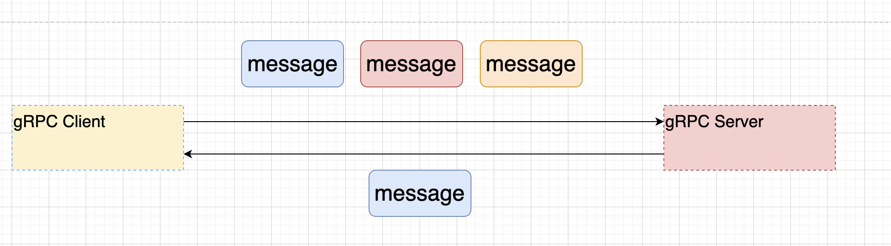

### 孙哥--分布式系列课程--RPC编程

#### 1. 引言

##### 1.1 RPC的概念

~~~markdown
1. RPC是远程调用（Remote Procedure Call)的缩写形式，是一种跨进程（JVM)的方法调用形式。是目前在Java分布式，微服务体系中，重要的一种通信方式。
~~~

##### 1.2 架构的演变过程

~~~markdown
1. 单体架构
1.1单体架构 --- 水平扩展
2. 垂直架构 --- 垂直划分 垂直扩展
3. RPC架构
~~~

###### 1. 单体架构

~~~markdown
1. 也叫做单体应用：就是系统中所有的功能（代码）耦合在了一起。并且生成一个jar[war]。部署在一个tomcat中（JVM一个进程）
~~~

###### 2. 单体架构存在的问题

~~~markdown
1. 热点问题（某个子系统访问量大，导致其他子系统的访问出现问题）
2. 扩展性差，新资源的分配力度不精确（门户系统访问量，增加机器，增加服务器tomcat。但是新增的资源，不能精确给到门户）
3. 模块（子系统）耦合度高、相互影响（修改某一个子系统的代码，产生了问题，影响其他的子系统）
4. 维护部署成本高（某次发布，只更新了后台管理的（订单模块），但是因为是单体架构，所以会发布整个系统。
5. 技术栈受限，必须使用相同的编程语言开发不同的子系统。
~~~

###### 3. 垂直架构

~~~markdown
1. 把一个单体架构的应用，按照子系统进行了划分，每个子系统都独立部署在自己的tomcat（JVM 进程）中。多个子系统共享数据库等存储资源。
2. 垂直架构做水平扩展。
3. 有限的解决了单体架构的部分问题。粒度（子系统）
   热点问题（子系统级别的热点问题解决了，但是模块的热点问题没有解决）。
   扩展性差 (子系统级别，增加机器，资源分配 相对精确)
   子系统耦合度降低，独立的更新，发版。
   维护 部署成本 有所好转
   技术栈也不要求统一语言（门户 PHP,后台管理 Java）
~~~

###### 4. RPC架构

~~~markdown
跨进程调用如何完成。走网络 进行网络编程
Http协议  TCP协议？
  1          2

如果走Http协议
              1.  Http协议对于程序员来讲 最方便的是 不用开发服务器（tomcat,resin,weblogic jboss)
              2.  服务器端 , 服务要通过 控制器进行暴露（Servlet Controller)
              3.  客户端：http请求（不一定通过浏览器）HttpClient ,OKHttp,RestTemplate WebClient
问题：   1. 包一层 不能直接通过网络调用Service
              2. Client代码过于繁琐了 new HttpClient() ---> Get Post  HttpGet HttpPost。不能直接表达业务含义。
              3. 走Http协议 传输数据 数据量大 。 慢
典型的技术实现方案：1 SpringCloud Feign  2 Hession RPC
              优势  Http协议 文本类型 字符串协议 跨语言平台好。

如果走TCP协议
             明确  跨进程间调用的本质是什么？首先 网络通信，网络通信什么？参数 返回值
             服务器端 自己开发 Socket NIO  Netty。接受client传递参数，需要调用哪个方法的名字。把结果返回
                             好处：可以直接进行Service的调用
             客户端自己开发 大量网络相关的代码。接受服务端的返回值
             自己定义应用协议 自己使用序列化的方式
             好处：效率高（3次握手  4次握手 ） 协议 自定义的 二进制 线程管理好
             坏处：开发难度大 对使用者不友好

典型的技术实现方案：Dubbo

2种方案 都可以称之为RPC 跨进程调用。
~~~

###### 5. RPC的设计

~~~markdown
1. 设计目标：让调用者像调用本地方法那样，去调用远端的服务方法。
2. RPC设计过程中解决的核心问题：
 
   1. 通信方式 TCP(Socket NIO Netty Mina)  Http
   2. TCP(自定义协议）
   3. 序列化 （JSON Protobuf Hessian)
   4. 在调用者这方 创建 远端服务类的代理类 
      传输数据 
      网络通信
      
3. 衍生的方案： 注册中心 核心作用 服务的治理 
              1. 负载均衡 
              2. 健康管理 服务管理 （心跳 重试【延迟队列】）
              3. 解耦合
              熔断 
              限流
~~~

#### 2. Hessian RPC  

~~~markdown
1. 为什么要学习
   a.纯粹的RPC,只解决了RPC中的4个核心问题（1，网络通信 2，协议 3，序列化 4，代理）
   b.Java写的
   c.HessianRPC落伍了，但是他的序列化方式，被Dubbo还在使用。
     Dubbo用的Hessian,阿里定制（Hessain Lite) Dubbo中默认启动的。
~~~

##### 2.1 HessianRPC概念

~~~markdown
1. Resin服务器的伴生产品。
2. 基于Java编程语言设计的RPC框架，只支持Java编程语言使用（服务的调用者，服务的提供者都得是Java开发)
3. 序列化协议 二级制 
4. 官网 http://hessian.caucho.com/doc/
~~~

##### 2.2 HessianRPC设计思想

##### 2.3 HessianRPC的开发

###### 2.3.1 环境搭建

~~~xml
<dependencies>
        <dependency>
            <groupId>junit</groupId>
            <artifactId>junit</artifactId>
            <version>4.13.1</version>
            <scope>test</scope>
        </dependency>

        <dependency>
            <groupId>javax.servlet</groupId>
            <artifactId>javax.servlet-api</artifactId>
            <version>3.1.0</version>
            <scope>provided</scope>
        </dependency>

        <dependency>
            <groupId>org.slf4j</groupId>
            <artifactId>slf4j-api</artifactId>
            <version>1.7.32</version>
        </dependency>

        <dependency>
            <groupId>ch.qos.logback</groupId>
            <artifactId>logback-classic</artifactId>
            <version>1.2.9</version>
        </dependency>

        <dependency>
            <groupId>org.projectlombok</groupId>
            <artifactId>lombok</artifactId>
            <version>1.18.22</version>
        </dependency>

        <dependency>
            <groupId>com.caucho</groupId>
            <artifactId>hessian</artifactId>
            <version>4.0.38</version>
        </dependency>
</dependencies>
~~~

###### 2.3.2 开发步骤

- 服务端 （RPC远端功能提供者）

  - 开发服务

    ~~~markdown
    1. 开发Service
    2. DAO --- Mybaits
    注意：一定要定义Service的接口，自定义的数据类型实现Serliazliable
    ~~~

  - 发布服务

    ~~~markdown
    1. web.xml进行配置
    2. 配置HessianServlet
    ~~~

    web.xml

    ~~~xml
    <servlet>
        <servlet-name>userServiceRPC</servlet-name>
        <servlet-class>com.caucho.hessian.server.HessianServlet</servlet-class>
        <init-param>
            <param-name>home-api</param-name>
            <param-value>com.suns.service.UserService</param-value>
        </init-param>
        <init-param>
            <param-name>home-class</param-name>
            <param-value>com.suns.service.UserServiceImpl</param-value>
        </init-param>
    </servlet>
    
    <servlet-mapping>
        <servlet-name>userServiceRPC</servlet-name>
        <url-pattern>/userServiceRPC</url-pattern>
    </servlet-mapping>

- 客户端（远端服务的调用者）

  ~~~java
  1. HessianProxyFactory
  2. 参数 1 远端服务的接口 2 url
    
  public class HessianRPCClient {
      public static void main(String[] args) throws MalformedURLException {
          HessianProxyFactory hessianProxyFactory = new HessianProxyFactory();
  
          //创建远端RPC服务的代理对象
          String URL = "http://localhost:8989/rpc-hessian/userServiceRPC";
          UserService userService = (UserService) hessianProxyFactory.create(UserService.class, URL);
          boolean userServiceRet = userService.login("xiaohei", "123456");
          log.debug("userServiceRet value is {} ", userServiceRet);
          
      }
  }
  ~~~

##### 2.4 HessianRPC核心源码分析

~~~java
1. HessianRPC client创建代理的方式 JDK Proxy.newProxyInstance()
   public Object create(Class<?> api, URL url, ClassLoader loader){
    if (api == null)
      throw new NullPointerException("api must not be null for HessianProxyFactory.create()");
    InvocationHandler handler = null;

    handler = new HessianProxy(url, this, api);

    return Proxy.newProxyInstance(loader,
                                  new Class[] { api,
                                                HessianRemoteObject.class },
                                  handler);
  }

2. 代理中   
     通过网络 Http请求 连接 远端RPC服务
     通过流 数据写出去了。
   HessianProxy#invoke()  
     1.通过 URLConnection 进行网络连接 
     2.解析协议 传递数据
~~~

##### 2.5 Hessian 序列化

~~~markdown
1. Hessian他的RPC 已经落伍了 过时
2. Hession序列化方式 还在使用 （Dubbo)
   Dubbo用的Hessian,阿里定制（Hessain Lite) Dubbo中默认启动的。
~~~

- 开发

  ~~~java
  //Hessian序列化的目的 就是为了传输数据  基本类型 对象（Seriazable接口）
          OutputStream outputStream = new FileOutputStream("/Users/sunshuai/Develop/code/java/idea/rpc-lession/rpc-hessian/test");
          Hessian2Output out = new Hessian2Output(outputStream);
          out.writeObject(new User("sunshuai", "123456"));
          out.flush();
          outputStream.close();
  
          //Hessian反序列化
          InputStream inputStream = new FileInputStream("/Users/sunshuai/Develop/code/java/idea/rpc-lession/rpc-hessian/test");
          Hessian2Input hessian2Input = new Hessian2Input(inputStream);
          User user = (User) hessian2Input.readObject();
  
          log.debug("{}", user);
  ~~~

#### 3. Thrift RPC

##### 3.1 ThriftRPC的引言 

###### 3.1.1 ThriftRPC 特点

~~~markdown
1. Thrift是一个RPC框架 
2. 可以进行异构系统的RPC调用
   什么叫做以后系统 服务的提供者 和 服务的调用者 不同编程语言开发系统。
3. 为什么在当前的系统开发中，会存在着异构系统的RPC?
   1. 存在异构系统的调用 
      Python ------> Hbase(Java)
             thrift
   2. 遗留系统的整合 
4. 设计一个异构系统的RPC 解决的核心问题是什么？
   肯定：异构系统的RPC 没有问题 只要双方 用各自的编程语言实现 网络编程中（client server)建立网络连接，进行通信即可。
   挑战：
        1. 得需要精通不同编程语言的网络 IO 线程等相关技术内容 （java go python c delphi....)
        2. 通信数据的格式，尤其是二进制的格式，得统一处理（中间的格式）
~~~

###### 3.1.1 ThriftRPC 框架

~~~markdown
1. 基本概念：是apache组织开源的一个顶级异构系统RPC框架,用于完成异构系统的PRC通信。
           多种编程语言 Java C++ PHP Phyton Ruby Node.jsp....
           2007 FaceBook Thrift 开源。
2. 特点：
   1. 跨语言支持 
   2. 开发快速 
   3. 学习简单 IDL语言 
   4. 稳定 
   
3. Thrift的设计思想
   1. 针对于不同的编程语言提供了一个库（jar） 
      作用：网络通信的代码 协议（序列化）相关的内容  java libthrift 
   2. IDL语言 中立语言 用于服务发布
   3. Thrift命令把IDL语言 自动转换成 你需要的编程语言。
~~~

###### 3.1.2 ThriftRPC安装

~~~markdown
1. 安装的是什么东西
   安装的就是把IDL转换成具体编程语言代码的命令。
2. 如何安装
   mac       brew install thrift 
   windows   http://www.apache.org/dyn/closer.cgi?path=/thrift/0.18.0/thrift-0.18.0.exe 
             https://blog.51cto.com/u_15854865/5810927
             
   如何验证： thrift -help   thrift --version 
3. 针对于不同的编程语言 安装库
   <dependency>
      <groupId>org.apache.thrift</groupId>
      <artifactId>libthrift</artifactId>
      <version>0.18.0</version>
   </dependency>
        
   python  pip install thrift 
   go
~~~

###### 3.1.3 IDL语法

> IDEA 中 Thrift插件，插件目的提示 校验IDL语法。
>
> IDL语法 必须 thrift

- 注释

  ~~~idl
  #    单行注释
  //   单行注释
  /*
  *    多行注释 
  */
  ~~~

- namespace

  ~~~idl
  namespace java com.suns
  namespace py com.suns
  
  指定生成好的代码 包 
  ~~~

- 基本类型

  ~~~markdown
  1.  i8      有符号的8位整数   byte
  2.  i16     有符号的16位整数  short
  3.  i32     有符号的32位整数  int
  4.  i64     有符号的64位整数  long
  5.  double  64位浮点数       double
  6.  bool    布尔值          boolean
  7.  string  字符串 字符      "" ''  UTF-8
  ~~~

- 集合类型

  ~~~idl
  list<T>   有序可重复    java.util.List 
  set<T>    无需不可重复  java.util.Set
  map<K,V>  k-v         java.util.Map
  
  map<i32,string> sex = {1:'female',2:'male'}
  list<i32> ages = [1,2,3,4]
  ~~~

- struct 自定义对象

  ~~~idl
  struct User{
     1: string name ='sunshuai',
     2: optional i32 age,
     3: list<i32> ages = [1,2,3,4]，
     4. required i32 hieght
  }
  
  1. struts 不能继承
  2. 成员与成员的分割，；
  3. 结构体里面的每一个字段 都要进行编号
  4. 变量类型 变量名
  5. optional 可选的 默认为每一个成员都加入的关键字
     代表这个字段在序列化过程中可选的。如果这个字段没有默认值，就不序列化，如果有默认值 就序列化.
  6. required 比选
  ~~~

- 枚举 （enum)

  ~~~idl
  enum SEASON{
     SPRING = 1,
     SUMMERT = 2
     ...
  }
  
  不支持嵌套，i32 
  ~~~

- 异常 （Exception)

  ~~~idl
  exception MyException{
     1: i32 errorCode
     2: string message
  }
  ~~~

- 服务 （Service)

  ~~~idl
  服务接口 
  service UserService{
     bool login(1:string name,2:string password)
     void register(1:User user) //User idl语言中的结构体 
  }
  
  注意：
    1. 异常
       service UserService{
          bool login(1:string name,2:string password) throws (1:MyException e,2:XXXException e)
          void register(1:User user) //User idl语言中的结构体 
        }
    2. oneway 表示客户端发起请求后不等待响应返回,只能和void 这种操作配合。
        service UserService{
          bool login(1:string name,2:string password) throws (1:MyException e,2:XXXException e)
          oneway void register(1:User user) //User idl语言中的结构体 
        }
    3. 继承
       service BaseService{
          void m1(1:string name)
       }
       service UserService extends BaseService{
          
       }
  ~~~

- include

  ~~~idl
  作用：进行IDL模块化编程
  
  suns1.thrift
     struct User{
        1:string name
     }
  suns2.thrift 
     include "suns1.thrift"
     
     service UserService{
       void register(1:suns1.User user)
     
     }
  ~~~

- Thrift把IDL生成对应代码的命令

  ~~~shell
  thrift --gen java xx.thrift 
  thrift --gen py xx.thrift
  
  thrift -r --gen java xx.thrift 

###### 3.1.4 Thrift RPC的开发

- 环境搭建

  ~~~markdown
  1. 安装Thrift 作用：把IDL语言描述的接口内容，生成对应编程语言的代码，简化开发。
  2. 引入依赖    作用：引入thrift针对于某一种编程语言的封装 （网络通信 协议【序列化】）
     <dependency>
        <groupId>org.apache.thrift</groupId>
        <artifactId>libthrift</artifactId>
        <version>0.13.0</version>
     </dependency>
     
    <dependency>
            <groupId>org.slf4j</groupId>
            <artifactId>slf4j-api</artifactId>
            <version>1.7.32</version>
        </dependency>
  
      <dependency>
          <groupId>ch.qos.logback</groupId>
          <artifactId>logback-classic</artifactId>
          <version>1.2.9</version>
      </dependency>
  ~~~

- 项目结构的定义

  ~~~markdown
  1. thrift-client  代表的是服务的调用者
  2. thrift-server  代表的是服务的提供者
  3. thrift-common  RPC编程共有的内容 1，实体类型 2，服务接口
  ~~~

- Thrift核心对象

  ~~~markdown
  1. TTransport
     作用：底层封装网络通信
     TSocket 阻塞IO通信
     TNonblockdingTransport 非阻塞网络通信
     TFramedTransport 加入了封帧的操作 （压缩后 数据边界问题）  
  2. TProtocol
     处理的协议 （序列化方式）
     TBinayProtocol 二进制进行序列化
     TCompactProtocol 压缩方式 处理二进制 
     TJSONProtocol  JSON进行序列化
  3. TProcessor
     业务处理：把通信数据 和 业务功能整合在一起
  4. TServer 服务端
  ~~~

- thrift-common

  ~~~markdown
  1. 通过IDL语言 定义 client与服务端 共用的数据类型 和 服务接口 
  2. client server端 引入 common模块
  ~~~

- 服务端

  ~~~markdown
  1. 实现服务接口 ：idl语言生成的
  2. 创建服务端代码
  ~~~

- 客户端

  ~~~markdown
  客户端要想本地方法那样 调用远端方法。 代理
  ~~~

###### 3.1.5 实战开发中的思考

~~~markdown
在实战开发中，往往服务端的功能 其实已经开发完成。
   1. 现有本地的功能 服务端的功能 写好了。
   2. 根据系统的功能，才有可能决定 这个服务发布成 RPC。
   
所以在发布RPC业务实现 IFace接口，主要通过原有的Service方法的调用，进行实现。这样维护性更好，也是实战中使用的方式。
~~~

###### 3.1.6TServer服务的相关内容

- TServer类型

  ~~~markdown
  1. 带表的是Thrift开发中的服务器。
  2. 功能：服务的开启serve()   服务的关闭stop()
  3. 阻塞 非阻塞 有没有线程池 Reactor模式
     TSimpleServer：        阻塞 单线程的服务器 （没有实战价值，只是用于测试）
     TThreadPoolServer:     阻塞 线程池的服务器 
     TNonBlockingServer:    非阻塞单线程的服务器 
     TThreadSelectorServer: 实现了主从版的Reactor(类似Netty)
  ~~~

- 分析TSimpleServer

  ~~~markdown
  目的：1. 了解Thrift相关类型的作用（源码的分析）
       2. 核实SimpleServer是一个阻塞的 单线程的服务器
  ~~~

  

- TThreadPoolServer

  ~~~markdown
  阻塞，引入了线程池 
  
  1. 如果使用，一定注意 默认的线程池 最大值 Integer.Max显然不成 需要maxWorkerThreads进行设置。
  2. 不能够让我们的线程复用，因为没有selector
  
  底层实现思路 
     把具体调用的Socket分配 WorkerProcess进行操作，而WorkerProcess从线程池中获得 线程资源。
  ~~~

- TNonblockingServer

  > 底层连接 必须使用 TFreameTransport ,TCompactProtocol

  ~~~markdown
  非阻塞  单线程
  
  Java NIO 
  
  SocketChannel#configureBlocking
  ServerSocketChannel#configureBlocking
  
  selector
  ~~~

- TThreadSelectorServer [主从版的Reactor模式的实现][实战中推荐]

  

  - client

    ~~~java
    public class TestClient1 {
        public static void main(String[] args) throws TException {
            //完成  与服务端 网络连接的连接
            TTransport tTransport = new TSocket("localhost", 9000);
            TFramedTransport tFramedTransport = new TFramedTransport(tTransport);
            tTransport.open();
    
            //创建协议
            TCompactProtocol tCompactProtocol = new TCompactProtocol(tFramedTransport);
    
            //创建代理  stub 存根 桩
            UserService.Client userService = new UserService.Client(tCompactProtocol);
    
            User user = userService.queryUserByNameAndPassword("xiaojr", "9090");
            System.out.println("user = " + user);
    
    
        }
    }
    ~~~

  - server

    ~~~java
    public class TestServer1 {
        public static void main(String[] args) throws TTransportException {
            TNonblockingServerSocket tNonblockingServerSocket = new TNonblockingServerSocket(9000);
    
            TFramedTransport.Factory tFramedTransport = new TFramedTransport.Factory();
            TCompactProtocol.Factory factory = new TCompactProtocol.Factory();
    
            UserService.Processor processor = new UserService.Processor(new UserServiceImpl());
    
            TThreadedSelectorServer.Args arg = new TThreadedSelectorServer.Args(tNonblockingServerSocket);
            arg.transportFactory(tFramedTransport);
            arg.protocolFactory(factory);
            arg.processor(processor);
    
            TServer tServer = new TThreadedSelectorServer(arg);
            tServer.serve();
        }
    }
    ~~~

  - 坑

    ~~~markdown
    1. client server thrift版本（maven） 一致
    2. client server通信的transport protocal 保持一致
    ~~~

#### 4. gRPC

##### 4.1 gRPC简介

~~~markdown
1. gRPC 是由google开源的一个高性能的RPC框架。Stubby Google内部的RPC,演化而来的，2015正式开源。云原生时代是一个RPC标准。
2. gRPC 核心的设计思路 
         1. 网络通信 ---> gRPC自己封装网络通信的部分 提供多种语言的 网络通信的封装 （C Java[Netty] GO)
         2. 协议    ---> HTTP2 传输数据的时候 二进制数据内容。 支持双向流（双工）连接的多路复用。
         3. 序列化   ---> 基本文本 JSON  基于二进制 Java原生序列化方式 Thrift二进制的序列化 压缩二级制序列化。
                         protobuf (Protocol Buffers) google开源一种序列化方式  时间效率和空间效率是JSON的3---5倍。
                         IDL语言 
         4. 代理的创建 --->让调用者像调用本地方法那样 去调用远端的服务方法。
                          stub
3. gRPC 与 ThriftRPC 区别
   共性：支持异构语言的RPC。
   区别：
        1. 网络通信 Thrift TCP   专属协议
                   GRPC   HTTP2
        2. 性能角度 ThriftRPC 性能 高于 gRPC
        3. gRPC 大厂背书（Google),云原生时代 与其他组件合作的顺利。所以gRPC应用更广泛。
        
4. gRPC的好处 
   1. 高效的进行进程间通信。
   2. 支持多种语言 原生支持 C  Go Java实现。C语言版本上扩展 C++ C# NodeJS Python Ruby PHP..
   3. 支持多平台运行 Linux Android IOS MacOS Windows。
   4. gPRC序列化方式采用protobuf，效率高。
   5. 使用Http2协议
   6. 大厂的背书
~~~

##### 4.2 Http2.0协议

~~~markdown
1. 回顾 Http1.x协议 
   Http1.0协议  请求响应的模式 短连接协议（无状态协议）  传输数据文本结构     单工 无法实现服务端推送 变相实现推动（客户端轮训的方式） 
   Http1.1协议  请求响应的模式 有限的长连接            升级的方式WebSocket 双工 实现服务器向客户端推送。
   总结Http1.x协议 共性
     1. 传输数据文本格式 可读性好的但是效率差。
     2. 本质上Http1.x协议无法实现双工通信。
     3. 资源的请求。需要发送多次请求，建立多个连接才可以完成。 
2. HTTP2.0协议 
     1. Http2.0协议是一个二进制协议，效率高于Http1.x协议，可读性差。
     2. 可以实现双工通信。
     3. 一个请求 一个连接 可以请求多个数据。【多路复用】
3. Http2.0协议的三个概念
     1. 数据流 stream
     2. 消息   message
     3. 帧    frame    参看图
4. 其他的相关概念
     1. 数据流的优先级，可以通过为不同的stream设置权重，来限制不同流的传输顺序。
     2. 流控 client发送的数据太快了，server处理不过来，通知client暂停数据的发送。
~~~

##### 4.3 Protocol Buffers [protobuf]

~~~markdown
1. protobuf 是一种与编程语言无关【IDL】,与具体的平台无关【OS】。他定义的中间语言，可以方便的在client 于 server中进行RPC的数据传输。
2. protobuf 两种版本 proto2 proto3,但是目前主流应用的都是proto3。
3. protobuf主要安装protobuf的编译器，编译器目的，可以把protobuf的IDL语言，转换成具体某一种开发语言。
~~~

###### 4.3.1 protobuf编译器的安装

~~~markdown
https://github.com/protocolbuffers/protobuf/releases
windows 版本
  1. 直接解压缩 方式在一个特定的目录下面
  2. 直接配置环境变量 path
     protoc --version
mac    版本
  brew install protobuf 
     protoc --version
~~~

###### 4.3.2 protobuf IDEA的插件

~~~markdown
1. 2021.2版本后面的新版本 IDEA内置了Protobuf插件
2. 之前版本 可以选装第三方Protobuf插件
3. 二者不能共存。
~~~

###### **4.3.3protobuf的语法详解**

- 文件格式

  ~~~markdown
  .proto
  
  UserService.proto
  OrderService.proto
  ~~~

- 版本设定

  ~~~markdown
  syntax = "proto3";
  ~~~

- 注释

  ~~~markdown
  1. 单行注释   //
  2. 多行注释   /*    */
  ~~~

- 与Java语言相关的语法

  ~~~markdown
  #后续protobuf生成的java代码 一个源文件还是多个源文件  xx.java
  option java_multiple_files = false; 
  
  #指定protobuf生成的类 放置在哪个包中
  option java_package = "com.suns";
  
  #指定的protobuf生成的外部类的名字（管理内部类【内部类才是真正开发使用】）
  option java_outer_classname = "UserServce";
  
  ~~~

- 逻辑包【了解】

  ~~~markdown
  # 对于protobuf对于文件内容的管理
  package xxx;
  ~~~

- 导入

  ~~~markdown
  UserService.proto
  
  OrderService.proto
    import "xxx/UserService.proto";
  ~~~

- 基本类型

  

- 枚举

  ~~~protobuf
  enum SEASON{
     SPRING = 0;
     SUMMER = 1;
  
  }
  枚举的值 必须是0开始 

- 消息 Message 

  ~~~protobuf
  message LoginRequest {
     string username = 1;
     singular string password = 2;
     int32  age = 3;
  }
  
  编号 从1开始 到2^29-1  注意：19000 - 19999 不能用这个区间内的编号，因为他是protobuf自己保留的。
  
  - singular : 这个字段的值 只能是0个或1个 （默认关键字）  null   "123456"
  - repeated
  
  message Result{
     string content = 1;
     repeated string stutas = 2; //这个字段 返回值 是多个 等价于 Java List Protobuf getStatusList()-->List
  }
  
  protobuf [grpc]
  可以定义多个消息 
  
  message LoginRequest{
    ....
  }
  
  message LoginResponse{
    ...
  }
  
  消息可以嵌套 
  message SearchResponse{
     message Result{
        string url = 1;
        string title = 2;
     }
  
    string xxx = 1;
    int32  yyy = 2;
    Result ppp = 3;
  }
  
  SearchResponse.Result
  
  message AAA{
    string xxx = 1;
    SearchResponse.Result yyy = 2;
  }
  
  oneof [其中一个]
  message SimpleMessage{
     oneof test_oneof{
        string name = 1;
        int32  age = 2;
     }
     
     test_oneof xxx
  }
  ~~~

- 服务

  ~~~protobuf
  service HelloService{
     rpc hello(HelloRequest) returns(HelloResponse){}
  }
  # 里面是可以定义多个服务方法。
  # 定义多个服务接口
  # gPRC 服务 4个服务方式 。
  ~~~

###### 4.3.4 第一个gPRC的开发

- 项目结构

  ~~~markdown
  1. xxxx-api 模块 
     定义 protobuf idl语言 
     并且通过命令创建对应的代码
     2. service 
  2. xxxx-server模块
     1. 实现api模块中定义的服务接口
     2. 发布gRPC服务 (创建服务端程序)
  3. xxxx-clien模块
     1. 创建服务端stub(代理)
     2. 基于代理（stub) RPC调用。
  ~~~

- api模块

  ~~~markdown
  1. .proto文件 书写protobuf的IDL
  2. [了解]protoc命令 把proto文件中的IDL 转换成编程语言 
     protoc --java_out=/xxx/xxx  /xxx/xxx/xx.proto
  3. [实战] maven插件 进行protobuf IDL文件的编译，并把他放置IDEA具体位置。
  ~~~

  ~~~xml
  pom.xml
   <dependencies>
          <dependency>
              <groupId>io.grpc</groupId>
              <artifactId>grpc-netty-shaded</artifactId>
              <version>1.52.1</version>
              <scope>runtime</scope>
          </dependency>
          <dependency>
              <groupId>io.grpc</groupId>
              <artifactId>grpc-protobuf</artifactId>
              <version>1.52.1</version>
          </dependency>
          <dependency>
              <groupId>io.grpc</groupId>
              <artifactId>grpc-stub</artifactId>
              <version>1.52.1</version>
          </dependency>
          <dependency> <!-- necessary for Java 9+ -->
              <groupId>org.apache.tomcat</groupId>
              <artifactId>annotations-api</artifactId>
              <version>6.0.53</version>
              <scope>provided</scope>
          </dependency>
   </dependencies>
  
  <build>
          <extensions>
              <extension>
                  <groupId>kr.motd.maven</groupId>
                  <artifactId>os-maven-plugin</artifactId>
                  <version>1.7.1</version>
              </extension>
          </extensions>
          <plugins>
              <plugin>
                  <groupId>org.xolstice.maven.plugins</groupId>
                  <artifactId>protobuf-maven-plugin</artifactId>
                  <version>0.6.1</version>
                  <configuration>
                      <protocArtifact>com.google.protobuf:protoc:3.21.7:exe:${os.detected.classifier}</protocArtifact>
                      <pluginId>grpc-java</pluginId>
                      <pluginArtifact>io.grpc:protoc-gen-grpc-java:1.52.1:exe:${os.detected.classifier}</pluginArtifact>
                  </configuration>
                  <executions>
                      <execution>
                          <goals>
                              <goal>compile</goal>
                              <goal>compile-custom</goal>
                          </goals>
                      </execution>
                  </executions>
              </plugin>
          </plugins>
      </build>
  
  ~~~

  

- xxxx-server 服务端模块的开发

  ~~~java
  1. 实现业务接口 添加具体的功能 （MyBatis+MySQL)
     public class HelloServiceImpl extends HelloServiceGrpc.HelloServiceImplBase {
      /*
        1. 接受client提交的参数  request.getParameter()
        2. 业务处理 service+dao 调用对应的业务功能。
        3. 提供返回值
       */
      @Override
      public void hello(HelloProto.HelloRequest request, StreamObserver<HelloProto.HelloResponse> responseObserver) {
          //1.接受client的请求参数
          String name = request.getName();
          //2.业务处理
          System.out.println("name parameter "+name);
          //3.封装响应
          //3.1 创建相应对象的构造者
          HelloProto.HelloResponse.Builder builder = HelloProto.HelloResponse.newBuilder();
          //3.2 填充数据
          builder.setResult("hello method invoke ok");
          //3.3 封装响应
          HelloProto.HelloResponse helloResponse = builder.build();
  
          responseObserver.onNext(helloResponse);
          responseObserver.onCompleted();;
      }
  }
  2. 创建服务端 （Netty)
  public class GprcServer1 {
      public static void main(String[] args) throws IOException, InterruptedException {
          //1. 绑定端口 
          ServerBuilder serverBuilder = ServerBuilder.forPort(9000);
          //2. 发布服务
          serverBuilder.addService(new HelloServiceImpl());
          //serverBuilder.addService(new UserServiceImpl());
          //3. 创建服务对象
          Server server = serverBuilder.build();
          
          server.start();
          server.awaitTermination();;
      }
  }
  ~~~

- xxx-client 模块

  ~~~java
  1. client通过代理对象完成远端对象的调用
  
  public class GprcClient1 {
      public static void main(String[] args) {
          //1 创建通信的管道
          ManagedChannel managedChannel = ManagedChannelBuilder.forAddress("localhost", 9000).usePlaintext().build();
          //2 获得代理对象 stub
          try {
              HelloServiceGrpc.HelloServiceBlockingStub helloService = HelloServiceGrpc.newBlockingStub(managedChannel);
              //3. 完成RPC调用
              //3.1 准备参数
              HelloProto.HelloRequest.Builder builder = HelloProto.HelloRequest.newBuilder();
              builder.setName("sunshuai");
              HelloProto.HelloRequest helloRequest = builder.build();
              //3.1 进行功能rpc调用，获取相应的内容
              HelloProto.HelloResponse helloResponse = helloService.hello(helloRequest);
              String result = helloResponse.getResult();
              System.out.println("result = " + result);
          } catch (Exception e) {
              throw new RuntimeException(e);
          }finally {
              managedChannel.shutdown();
          }
      }
  }
  ~~~

- 注意事项

  ~~~markdown
  服务端 处理返回值时
  responseObserver.onNext(helloResponse1);  //通过这个方法 把响应的消息 回传client
  responseObserver.onCompleted();           //通知client 整个服务结束。底层返回标记 
                                            // client就会监听标记 【grpc做的】
                                            
  requestObserver.onNext(helloRequest1);
  requestObserver.onCompleted();

###### 4.3.5gRpc的四种通信方式

- 四种通信方式

  ~~~markdown
  1. 简单rpc 一元rpc (Unary RPC)
  2. 服务端流式RPC   (Server Streaming RPC)
  3. 客户端流式RPC   (Client Streaming RPC)
  4. 双向流RPC (Bi-directional Stream RPC)
  ~~~

- 简单RPC(一元RPC)

  ~~~markdown
  1. 第一个RPC程序，实际上就是一元RPC
  ~~~

  - 特点

    ~~~markdown
    当client发起调用后，提交数据，并且等待 服务端响应。
    开发过程中，主要采用就是一元RPC的这种通信方式
    ~~~

    

  - 语法

    ~~~protobuf
    service HelloService{
      rpc hello(HelloRequest) returns (HelloResponse){}
      rpc hello1(HelloRequest1) returns (HelloResponse1){}
    }
    ~~~

- 服务端流式RPC 

  ~~~markdown
  一个请求对象，服务端可以回传多个结果对象。
  ~~~

  - 特点

    

  - 使用场景

    ~~~markdown
    client  --------> Server
            股票标号
            <-------
             某一个时刻的 股票的行情
    ~~~

  - 语法

    ~~~markdown
    service HelloService{
      rpc hello(HelloRequest) returns (stream HelloResponse){}
      rpc hello1(HelloRequest1) returns (HelloResponse1){}
    }
    ~~~

  - 关键代码

    ~~~java
    服务端
    public void c2ss(HelloProto.HelloRequest request, StreamObserver<HelloProto.HelloResponse> responseObserver) {
            //1 接受client的请求参数
            String name = request.getName();
            //2 做业务处理
            System.out.println("name = " + name);
            //3 根据业务处理的结果，提供响应
            for (int i = 0; i < 9; i++) {
                HelloProto.HelloResponse.Builder builder = HelloProto.HelloResponse.newBuilder();
                builder.setResult("处理的结果 " + i);
                HelloProto.HelloResponse helloResponse = builder.build();
    
                responseObserver.onNext(helloResponse);
                try {
                    Thread.sleep(1000);
                } catch (InterruptedException e) {
                    throw new RuntimeException(e);
                }
            }
            responseObserver.onCompleted();
        }
    客户端
    public class GprcClient3 {
        public static void main(String[] args) {
            ManagedChannel managedChannel = ManagedChannelBuilder.forAddress("localhost", 9000).usePlaintext().build();
            try {
                HelloServiceGrpc.HelloServiceBlockingStub helloService = HelloServiceGrpc.newBlockingStub(managedChannel);
    
                HelloProto.HelloRequest.Builder builder = HelloProto.HelloRequest.newBuilder();
                builder.setName("sunshuai");
                HelloProto.HelloRequest helloRequest = builder.build();
                Iterator<HelloProto.HelloResponse> helloResponseIterator = helloService.c2ss(helloRequest);
                while (helloResponseIterator.hasNext()) {
                    HelloProto.HelloResponse helloResponse = helloResponseIterator.next();
                    System.out.println("helloResponse.getResult() = " + helloResponse.getResult());
                }
            } catch (Exception e) {
                e.printStackTrace();
            }
            finally {
                managedChannel.shutdown();
            }
        }
    }
    
    监听 异步方式 处理服务端流式RPC的开发
    1. api
    2. 服务端 
    3. 客户端 
       public class GrpcClient4 {
        public static void main(String[] args) {
            ManagedChannel managedChannel = ManagedChannelBuilder.forAddress("localhost", 9000).usePlaintext().build();
    
            try {
    
                HelloServiceGrpc.HelloServiceStub helloService = HelloServiceGrpc.newStub(managedChannel);
    
                HelloProto.HelloRequest.Builder builder = HelloProto.HelloRequest.newBuilder();
                builder.setName("xiaohei");
                HelloProto.HelloRequest helloRequest = builder.build();
    
                helloService.c2ss(helloRequest, new StreamObserver<HelloProto.HelloResponse>() {
                    @Override
                    public void onNext(HelloProto.HelloResponse value) {
                        //服务端 响应了 一个消息后，需要立即处理的话。把代码写在这个方法中。
                        System.out.println("服务端每一次响应的信息 " + value.getResult());
                    }
    
                    @Override
                    public void onError(Throwable t) {
    
                    }
    
                    @Override
                    public void onCompleted() {
                        //需要把服务端 响应的所有数据 拿到后，在进行业务处理。
                        System.out.println("服务端响应结束 后续可以根据需要 在这里统一处理服务端响应的所有内容");
                    }
                });
    
                managedChannel.awaitTermination(12, TimeUnit.SECONDS);
    
            } catch (Exception e) {
                e.printStackTrace();
            } finally {
                managedChannel.shutdown();
            }
        }
    }
    ~~~

- 客户端流式RPC

  ~~~markdown
  客户端发送多个请求对象，服务端只返回一个结果
  ~~~

  

  - 应用场景

    ~~~markdown
    IOT(物联网 【传感器】) 向服务端 发送数据
    ~~~

  - proto

    ~~~protobuf
    rpc cs2s(stream HelloRequest) returns (HelloResponse){}
    ~~~

  - 开发

    ~~~java
    1. api
       rpc cs2s(stream HelloRequest) returns (HelloResponse){}
    2. 服务端开发
       public StreamObserver<HelloProto.HelloRequest> cs2s(StreamObserver<HelloProto.HelloResponse> responseObserver) {
            return new StreamObserver<HelloProto.HelloRequest>() {
                @Override
                public void onNext(HelloProto.HelloRequest value) {
                    System.out.println("接受到了client发送一条消息 " + value.getName());
                }
    
                @Override
                public void onError(Throwable t) {
    
                }
    
                @Override
                public void onCompleted() {
                    System.out.println("client的所有消息 都发送到了 服务端 ....");
    
                    //提供响应：响应的目的：当接受了全部client提交的信息，并处理后，提供相应
                    HelloProto.HelloResponse.Builder builder = HelloProto.HelloResponse.newBuilder();
                    builder.setResult("this is result");
                    HelloProto.HelloResponse helloResponse = builder.build();
    
                    responseObserver.onNext(helloResponse);
                    responseObserver.onCompleted();
                }
            };
        }
    3. 客户端开发
       public class GrpcClient5 {
        public static void main(String[] args) {
            ManagedChannel managedChannel = ManagedChannelBuilder.forAddress("localhost", 9000).usePlaintext().build();
            try {
                HelloServiceGrpc.HelloServiceStub helloService = HelloServiceGrpc.newStub(managedChannel);
    
                StreamObserver<HelloProto.HelloRequest> helloRequestStreamObserver = helloService.cs2s(new StreamObserver<HelloProto.HelloResponse>() {
                    @Override
                    public void onNext(HelloProto.HelloResponse value) {
                        // 监控响应
                        System.out.println("服务端 响应 数据内容为 " + value.getResult());
    
                    }
    
                    @Override
                    public void onError(Throwable t) {
    
                    }
    
                    @Override
                    public void onCompleted() {
                        System.out.println("服务端响应结束 ... ");
                    }
                });
    
                //客户端 发送数据 到服务端  多条数据 ，不定时...
                for (int i = 0; i < 10; i++) {
                    HelloProto.HelloRequest.Builder builder = HelloProto.HelloRequest.newBuilder();
                    builder.setName("sunshuai " + i);
                    HelloProto.HelloRequest helloRequest = builder.build();
    
                    helloRequestStreamObserver.onNext(helloRequest);
                    Thread.sleep(1000);
                }
    
                helloRequestStreamObserver.onCompleted();
    
                managedChannel.awaitTermination(12, TimeUnit.SECONDS);
    
            } catch (Exception e) {
                e.printStackTrace();
            } finally {
                managedChannel.shutdown();
            }
        }
    }
    ~~~

- 双向流式RPC

  ~~~markdown
  客户端可以发送多个请求消息，服务端响应多个响应消息
  ~~~

  

  - 应用场景

    ~~~markdown
    聊天室
    ~~~

  - 编码

    ~~~java
    1. api
        rpc cs2ss(stream HelloRequest) returns (stream HelloResponse){}
    2. 服务端
        public StreamObserver<HelloProto.HelloRequest> cs2ss(StreamObserver<HelloProto.HelloResponse> responseObserver) {
             return new StreamObserver<HelloProto.HelloRequest>() {
                 @Override
                 public void onNext(HelloProto.HelloRequest value) {
                     System.out.println("接受到client 提交的消息 "+value.getName());
                     responseObserver.onNext(HelloProto.HelloResponse.newBuilder().setResult("response "+value.getName()+" result ").build());
                 }
    
                 @Override
                 public void onError(Throwable t) {
    
                 }
    
                 @Override
                 public void onCompleted() {
                     System.out.println("接受到了所有的请求消息 ... ");
                     responseObserver.onCompleted();
                 }
             };
        }
    3. 客户端
      public class GrpcClient6 {
        public static void main(String[] args) {
            ManagedChannel managedChannel = ManagedChannelBuilder.forAddress("localhost", 9000).usePlaintext().build();
            try {
                HelloServiceGrpc.HelloServiceStub helloService = HelloServiceGrpc.newStub(managedChannel);
    
                StreamObserver<HelloProto.HelloRequest> helloRequestStreamObserver = helloService.cs2ss(new StreamObserver<HelloProto.HelloResponse>() {
                    @Override
                    public void onNext(HelloProto.HelloResponse value) {
                        System.out.println("响应的结果 "+value.getResult());
                    }
    
                    @Override
                    public void onError(Throwable t) {
    
                    }
    
                    @Override
                    public void onCompleted() {
                        System.out.println("响应全部结束...");
                    }
                });
    
    
                for (int i = 0; i < 10; i++) {
                    helloRequestStreamObserver.onNext(HelloProto.HelloRequest.newBuilder().setName("sunshuai " + i).build());
                }
                helloRequestStreamObserver.onCompleted();
    
                managedChannel.awaitTermination(12, TimeUnit.SECONDS);
    
            } catch (Exception e) {
                e.printStackTrace();
            } finally {
                managedChannel.shutdown();
            }
        }
    }
    ~~~

###### 4.3.6 gPRC代理方式

~~~markdown
1. BlockingStub
   阻塞 通信方式 
2. Stub
   异步 通过监听处理的
3. FutureStub
   同步 异步 NettyFuture
   1. FutureStub只能应用 一元RPC 
~~~

~~~java
public class GrpcClient7 {
    public static void main(String[] args) {
        ManagedChannel managedChannel = ManagedChannelBuilder.forAddress("localhost", 9000).usePlaintext().build();
        try {
            TestServiceGrpc.TestServiceFutureStub testServiceFutureStub = TestServiceGrpc.newFutureStub(managedChannel);
            ListenableFuture<TestProto.TestResponse> responseListenableFuture = testServiceFutureStub.testSuns(TestProto.TestRequest.newBuilder().setName("xiaojren").build());

            /* 同步操作
            TestProto.TestResponse testResponse = responseListenableFuture.get();
            System.out.println(testResponse.getResult());*/

          /*  responseListenableFuture.addListener(() -> {
                System.out.println("异步的rpc响应 回来了....");
            }, Executors.newCachedThreadPool());*/

            Futures.addCallback(responseListenableFuture, new FutureCallback<TestProto.TestResponse>() {
                @Override
                public void onSuccess(TestProto.TestResponse result) {
                    System.out.println("result.getResult() = " + result.getResult());
                }

                @Override
                public void onFailure(Throwable t) {

                }
            }, Executors.newCachedThreadPool());

            System.out.println("后续的操作....");

            managedChannel.awaitTermination(12, TimeUnit.SECONDS);
        } catch (Exception e) {
            e.printStackTrace();
        } finally {
            managedChannel.shutdown();
        }
    }
}
~~~

#### 5. gPRC与SpringBoot整合

##### 5.1 gRPC和SpringBoot整合的思想 

~~~markdown
1. grpc-server
2. grpc-client 
~~~

###### SpringBoot与GRPC整合的过程中 对于服务端做了什么封装

- 搭建开发环境

  ~~~markdown
  1. 搭建SpringBoot的开发环境
     
  2. 引入与Grpc相关的内容
      <dependency>
            <groupId>com.suns</groupId>
            <artifactId>rpc-grpc-api</artifactId>
            <version>1.0-SNAPSHOT</version>
       </dependency>
  
      <dependency>
          <groupId>net.devh</groupId>
          <artifactId>grpc-server-spring-boot-starter</artifactId>
          <version>2.14.0.RELEASE</version>
      </dependency>
  
  ~~~

- 开发服务

  ~~~java
  // 重复 多次 
  @GrpcService
  public class HelloServiceImpl extends HelloServiceGrpc.HelloServiceImplBase {
      @Override
      public void hello(HelloProto.HelloRequest request, StreamObserver<HelloProto.HelloResponse> responseObserver) {
          String name = request.getName();
          System.out.println("name is " + name);
  
          responseObserver.onNext(HelloProto.HelloResponse.newBuilder().setResult("this is result").build());
          responseObserver.onCompleted();
      }
  }
  // application.yml
  # 核心配置的 就是gRPC服务的端口号
  spring:
    application:
      name: boot-server
  
    main:
      web-application-type: none
  
  grpc:
    server:
      port: 9000
  
  ~~~

- 客户端

  环境搭建

  ~~~markdown
   <dependency>
      <groupId>net.devh</groupId>
      <artifactId>grpc-client-spring-boot-starter</artifactId>
      <version>2.14.0.RELEASE</version>
   </dependency>
  ~~~

  编码

  ~~~markdown
  1. yml
  grpc:
    client:
      grpc-server:
        address: 'static://127.0.0.1:9000'
        negotiation-type: plaintext
        
  2. 注入stub
  
  @GrpcClient("grpc-server")
  private HelloServiceGrpc.HelloServiceBlockingStub stub;
  ~~~

#### 6. gPRC的高级应用

~~~markdown
1. 拦截器  一元拦截器 
2. Stream Tracer [监听流]  流拦截器 
3. Retry Policy 客户端重试 
4. NameResolver 
5. 负载均衡 （pick-first , 轮训）
6. grpc与微服务的整合 
   序列化 （protobuf) Dobbo
   grpc              Dobbo
   grpc              GateWay
   grpc              JWT
   grpc              Nacos2.0
   grpc              OpenFeign 
~~~

##### 6.1 拦截器

~~~markdown
1. 拦截器的作用
   鉴权 ，数据校验 ，限流...
2. 常见的拦截器 
   web        Filter
   springmvc  Interceptor 
   SS         Filter
   Netty      handler
3. gRPC的拦截器 
   1.  一元请求的 拦截器 
       客户端 【请求 响应】
       服务端 【请求 响应】
   2.  流式请求的 拦截器  （Stream Tracer)
       客户端 【请求 响应】
       服务端 【请求 响应】
~~~

###### 6.1.1 一元拦截器

- 简单客户端拦截器的开发

  ~~~java
  //1 开发拦截器 
  @Slf4j
  public class CustomClientInterceptor implements ClientInterceptor {
      @Override
      public <ReqT, RespT> ClientCall<ReqT, RespT> interceptCall(MethodDescriptor<ReqT, RespT> method, CallOptions callOptions, Channel next) {
          log.debug("这是一个拦截启动的处理 ,统一的做了一些操作 ....");
          return next.newCall(method, callOptions);
      }
  }
  
  
  //2 在客户端进行设置 
   ManagedChannel managedChannel = ManagedChannelBuilder.forAddress("localhost", 9000)
                  .usePlaintext()
                  .intercept(new CustomClientInterceptor())
                  .build();
  细节：
    usePlaintext()
    intercept(）
    调用的先后顺序没有必须关联，谁先谁后都行。
  ~~~

- 简单客户端拦截器问题

  ~~~markdown
  1. 只能拦截请求，不能拦截响应。
  2. 即使拦截了请求操作，粒度业务过于宽泛，不精准。
     1. 开始阶段 2. 设置消息数量 3.发送数据阶段 4.半连接阶段。
  ~~~

- 复杂客户端拦截器 

  ~~~java
  1. 拦截请求，拦截响应。
  2. 分阶段的进行 请求 响应的拦截
  
  渗透的 ClientCall[方法]  装饰器设计模式 典型的使用场景。
  
  public class CustomClientInterceptor implements ClientInterceptor {
      @Override
      public <ReqT, RespT> ClientCall<ReqT, RespT> interceptCall(MethodDescriptor<ReqT, RespT> method, CallOptions callOptions, Channel next) {
          log.debug("这是一个拦截启动的处理 ,统一的做了一些操作 ....");
          /*
             如果我们需要用复杂客户端拦截器 ，就需要对原始的ClientCall进行包装
             那么这个时候，就不能反悔原始ClientCall对象，
             应该返回 包装的ClientCall ---> CustomForwardingClientClass
           */
          //return next.newCall(method, callOptions);
          return new CustomForwardingClientClass<>(next.newCall(method, callOptions));
      }
  }
  
  /*
     这个类型 适用于控制 拦截 请求发送各个环节
   */
  @Slf4j
  class CustomForwardingClientClass<ReqT, RespT> extends ClientInterceptors.CheckedForwardingClientCall<ReqT, RespT> {
  
      protected CustomForwardingClientClass(ClientCall<ReqT, RespT> delegate) {
          super(delegate);
      }
  
      @Override
      //开始调用
      // 目的 看一个这个RPC请求是不是可以被发起。
      protected void checkedStart(Listener<RespT> responseListener, Metadata headers) throws Exception {
          log.debug("发送请求数据之前的检查.....");
          //真正的去发起grpc的请求
          // 是否真正发送grpc的请求，取决这个start方法的调用
          //delegate().start(responseListener, headers);
          delegate().start(new CustomCallListener<>(responseListener), headers);
      }
  
      @Override
      //指定发送消息的数量
      public void request(int numMessages) {
          //添加一些功能
          log.debug("request 方法被调用 ....");
          super.request(numMessages);
      }
  
      @Override
      //发送消息 缓冲区
      public void sendMessage(ReqT message) {
          log.debug("sendMessage 方法被调用... {} ", message);
          super.sendMessage(message);
      }
  
      @Override
      //开启半连接 请求消息无法发送，但是可以接受响应的消息
      public void halfClose() {
          log.debug("halfClose 方法被调用... 开启了半连接");
          super.halfClose();
      }
  }
  
  /*
     用于监听响应，并对响应进行拦截
   */
  @Slf4j
  class CustomCallListener<RespT> extends ForwardingClientCallListener.SimpleForwardingClientCallListener<RespT> {
      protected CustomCallListener(ClientCall.Listener<RespT> delegate) {
          super(delegate);
      }
  
      @Override
      public void onHeaders(Metadata headers) {
          log.info("响应头信息 回来了......");
          super.onHeaders(headers);
      }
  
      @Override
      public void onMessage(RespT message) {
          log.info("响应的数据 回来了.....{} ", message);
          super.onMessage(message);
      }
  }
  
  
  onHeaders这个方法 会在onNext调用后 监听到数据
  onMessage这个方法 会在onCompleted调用后 监听到数据
  ~~~

- 简单服务端拦截器

  ~~~java
  @Slf4j
  public class CustomServerInterceptor implements ServerInterceptor {
      @Override
      public <ReqT, RespT> ServerCall.Listener<ReqT> interceptCall(ServerCall<ReqT, RespT> call, Metadata headers, ServerCallHandler<ReqT, RespT> next) {
          //在服务器端 拦截请求操作的功能 写在这个方法中
          log.debug("服务器端拦截器生效.....");
          return next.startCall(call, headers);
      }
  }
  
  
  public class GrpcServer {
      public static void main(String[] args) throws InterruptedException, IOException {
          ServerBuilder<?> serverBuilder = ServerBuilder.forPort(9000);
          serverBuilder.addService(new HelloServiceImpl());
          serverBuilder.intercept(new CustomServerInterceptor());
          Server server = serverBuilder.build();
  
          server.start();
          server.awaitTermination();
      }
  }
  ~~~

- 简单服务端拦截器问题

  ~~~markdown
  1. 拦截请求发送过来的数据，无法处理响应的数据
  2. 拦截力度过于宽泛
  ~~~

- 复杂服务端拦截器

  ~~~markdown
  1. 拦截请求的数据，拦截响应的数据
  2. 粒度细致
  ~~~

  - 请求数据的拦截

    ~~~java
    @Slf4j
    public class CustomServerInterceptor implements ServerInterceptor {
        @Override
        public <ReqT, RespT> ServerCall.Listener<ReqT> interceptCall(ServerCall<ReqT, RespT> call, Metadata headers, ServerCallHandler<ReqT, RespT> next) {
            //在服务器端 拦截请求操作的功能 写在这个方法中
            log.debug("服务器端拦截器生效.....");
            //默认返回的ServerCall.Listener仅仅能够完成请求数据的监听，单没有拦截功能
            //所以要做扩展，采用包装器设计模式。
            //return next.startCall(call, headers);
            return new CustomServerCallListener<>(next.startCall(call, headers));
        }
    }
    
    @Slf4j
    class CustomServerCallListener<ReqT> extends ForwardingServerCallListener.SimpleForwardingServerCallListener<ReqT> {
        protected CustomServerCallListener(ServerCall.Listener<ReqT> delegate) {
            super(delegate);
        }
    
        @Override
        //准备接受请求数据
        public void onReady() {
            log.debug("onRead Method Invoke....");
            super.onReady();
        }
    
        @Override
        public void onMessage(ReqT message) {
            log.debug("接受到了 请求提交的数据  {} ", message);
            super.onMessage(message);
        }
    
        @Override
        public void onHalfClose() {
            log.debug("监听到了 半连接...");
            super.onHalfClose();
        }
    
        @Override
        public void onComplete() {
            log.debug("服务端 onCompleted()...");
            super.onComplete();
        }
    
        @Override
        public void onCancel() {
            log.debug("出现异常后 会调用这个方法... 关闭资源的操作");
            super.onCancel();
        }
    }
    
    ~~~

  - 拦截响应

    ~~~java
    目的：通过自定义的ServerCall 包装原始的ServerCall 增加对于响应拦截的功能
    @Slf4j
    class CustomServerCall<ReqT, RespT> extends ForwardingServerCall.SimpleForwardingServerCall<ReqT, RespT> {
    
        protected CustomServerCall(ServerCall<ReqT, RespT> delegate) {
            super(delegate);
        }
    
        @Override
        //指定发送消息的数量 【响应消息】
        public void request(int numMessages) {
            log.debug("response 指定消息的数量 【request】");
            super.request(numMessages);
        }
    
        @Override
        //设置响应头
        public void sendHeaders(Metadata headers) {
            log.debug("response 设置响应头 【sendHeaders】");
            super.sendHeaders(headers);
        }
    
        @Override
        //响应数据
        public void sendMessage(RespT message) {
            log.debug("response 响应数据  【send Message 】 {} ", message);
            super.sendMessage(message);
        }
    
        @Override
        //关闭连接
        public void close(Status status, Metadata trailers) {
            log.debug("respnse 关闭连接 【close】");
            super.close(status, trailers);
        }
    }
    
    目的：就是把自定义的ServerCall与gRpc服务端进行整合
    @Slf4j
    public class CustomServerInterceptor implements ServerInterceptor {
        @Override
        public <ReqT, RespT> ServerCall.Listener<ReqT> interceptCall(ServerCall<ReqT, RespT> call, Metadata headers, ServerCallHandler<ReqT, RespT> next) {
            //在服务器端 拦截请求操作的功能 写在这个方法中
            log.debug("服务器端拦截器生效.....");
          
            //1. 包装ServerCall 处理服务端响应拦截
            CustomServerCall<ReqT,RespT> reqTRespTCustomServerCall = new CustomServerCall<>(call);
            //2. 包装Listener   处理服务端请求拦截
            CustomServerCallListener<ReqT> reqTCustomServerCallListener = new CustomServerCallListener<>(next.startCall(reqTRespTCustomServerCall, headers));
            return reqTCustomServerCallListener;
        }
    }
    ~~~

###### 6.1.2 流式拦截器

~~~markdown
主要应用 gRPC除了 一元RPC之外的其他形式RPC操作的拦截工作
1. 服务端流式RPC
2. 客户端流式RPC
3. 双向流式RPC
~~~

- 一元通信方式 和 流式通信方式的区别

  ~~~markdown
  对比 一元通信方式，流式通信方式的特点是消息多，而且不是一次性通信，是分批分期。这个时候一元拦截器就无法细粒度的拦截特定的消息。
  所以需要流式拦截器 解决这个问题。流式拦截器【Stream Tracer】
  ~~~

- 客户端流式拦截器的开发

  ~~~markdown
  1. 拦截请求  拦截响应
  2. 开发思路 
     ClientStreamTracer [拦截请求 拦截响应]
     ClientStreamTracerFactory 
        目的 就是用于创建ClientStreamTracer.
  ~~~

  ~~~java
  @Slf4j
  public class CustomerClientInterceptor implements ClientInterceptor {
      @Override
      public <ReqT, RespT> ClientCall<ReqT, RespT> interceptCall(MethodDescriptor<ReqT, RespT> method, CallOptions callOptions, Channel next) {
          log.debug("执行客户端拦截器...");
  
  
          //把自己开发的ClientStreamTracerFactory融入到gRPC体系
          callOptions = callOptions.withStreamTracerFactory(new CustomClientStreamTracerFactory<>());
          return next.newCall(method, callOptions);
      }
  }
  
  class CustomClientStreamTracerFactory<ReqT, RespT> extends ClientStreamTracer.Factory {
      @Override
      public ClientStreamTracer newClientStreamTracer(ClientStreamTracer.StreamInfo info, Metadata headers) {
          return new CustomClientStreamTracer<>();
      }
  }
  
  
  /*
   作用： 用于客户端流式拦截：拦截请求 拦截响应
   */
  @Slf4j
  class CustomClientStreamTracer<ReqT, RespT> extends ClientStreamTracer {
      //outbound 对于请求相关操作的拦截
  
      @Override
      //用于输出响应头
      public void outboundHeaders() {
          log.debug("client: 用于输出请求头.....");
          super.outboundHeaders();
      }
  
      @Override
      //设置消息编号
      public void outboundMessage(int seqNo) {
          log.debug("client: 设置流消息的编号 {} ", seqNo);
          super.outboundMessage(seqNo);
      }
  
      @Override
      public void outboundUncompressedSize(long bytes) {
          log.debug("client: 获得未压缩消息的大小 {} ", bytes);
          super.outboundUncompressedSize(bytes);
      }
  
      @Override
      //用于获得 输出消息的大小
      public void outboundWireSize(long bytes) {
          log.debug("client: 用于获得 输出消息的大小 {} ", bytes);
          super.outboundWireSize(bytes);
      }
  
      @Override
      //拦截消息发送
      public void outboundMessageSent(int seqNo, long optionalWireSize, long optionalUncompressedSize) {
          log.debug("client: 监控请求操作 outboundMessageSent {} ", seqNo);
          super.outboundMessageSent(seqNo, optionalWireSize, optionalUncompressedSize);
      }
  
  
      //inbound  对于相应相关操作的拦截
      @Override
      public void inboundHeaders() {
          log.debug("用于获得响应头....");
          super.inboundHeaders();
      }
  
      @Override
      public void inboundMessage(int seqNo) {
          log.debug("获得响应消息的编号...{} ",seqNo);
          super.inboundMessage(seqNo);
      }
  
      @Override
      public void inboundWireSize(long bytes) {
          log.debug("获得响应消息的大小...{} ",bytes);
          super.inboundWireSize(bytes);
      }
  
      @Override
      public void inboundMessageRead(int seqNo, long optionalWireSize, long optionalUncompressedSize) {
          log.debug("集中获得消息的编号 ，大小 ，未压缩大小 {} {} {}", seqNo, optionalWireSize, optionalUncompressedSize);
          super.inboundMessageRead(seqNo, optionalWireSize, optionalUncompressedSize);
      }
  
      @Override
      public void inboundUncompressedSize(long bytes) {
          log.debug("获得响应消息未压缩大小 {} ",bytes);
          super.inboundUncompressedSize(bytes);
      }
  
      @Override
      public void inboundTrailers(Metadata trailers) {
          log.debug("响应结束..");
          super.inboundTrailers(trailers);
      }
  }
  ~~~

- 服务端流式拦截器的开发

  ~~~markdown
  1. ServerStreamTracer 拦截
     inbound  请求的拦截
     outbound 响应的拦截 
  2. ServerStreamTracerFactory进行创建
     
  ~~~

  ~~~java
  public class CustomServerStreamFactory extends ServerStreamTracer.Factory {
      @Override
      public ServerStreamTracer newServerStreamTracer(String fullMethodName, Metadata headers) {
          return new CustomServerStreamTracer();
      }
  }
  
  @Slf4j
  class CustomServerStreamTracer extends ServerStreamTracer {
      //inbound 拦截请求
      @Override
      public void inboundMessage(int seqNo) {
          super.inboundMessage(seqNo);
      }
  
      @Override
      public void inboundWireSize(long bytes) {
          super.inboundWireSize(bytes);
      }
  
      @Override
      public void inboundMessageRead(int seqNo, long optionalWireSize, long optionalUncompressedSize) {
          log.debug("server: 获得client发送的请求消息 ...{} {} {}", seqNo, optionalWireSize, optionalUncompressedSize);
          super.inboundMessageRead(seqNo, optionalWireSize, optionalUncompressedSize);
      }
  
      @Override
      public void inboundUncompressedSize(long bytes) {
          super.inboundUncompressedSize(bytes);
      }
  
      //outbound 拦截请求
  
      @Override
      public void outboundMessage(int seqNo) {
          super.outboundMessage(seqNo);
      }
  
  
      @Override
      public void outboundMessageSent(int seqNo, long optionalWireSize, long optionalUncompressedSize) {
          log.debug("server: 响应数据的拦截 ...{} {} {}", seqNo, optionalWireSize, optionalUncompressedSize);
          super.outboundMessageSent(seqNo, optionalWireSize, optionalUncompressedSize);
      }
  
      @Override
      public void outboundWireSize(long bytes) {
          super.outboundWireSize(bytes);
      }
  
      @Override
      public void outboundUncompressedSize(long bytes) {
          super.outboundUncompressedSize(bytes);
      }
  }
  
  serverBuilder.addStreamTracerFactory(new CustomServerStreamFactory());
  ~~~

##### 6.2 客户端重试

~~~markdown
客户端重试保证了系统可靠性。
在RGPC调用过程中看，因为网络延迟 或者抖动，可能操作客户端暂时链接不上服务端的情况，如果出现了此类情况的话。那么可以让client重试连接。尽可能的避免，因为网络问题，影响通信。从而保证了系统的可靠性。
~~~

- 开发

  ~~~java
  1. 服务端 
     模拟网络问题 
  2. 客户端
     {
    "methodConfig": [
      {
        "name": [
          {
            "service": "com.suns.HelloService", //服务的名字 包名 package
            "method": "hello"  //服务方法名字 
          }
        ],
        "retryPolicy": {
          "maxAttempts": 3,         //重试的次数 
          "initialBackoff": "0.5s", //初始重试的延迟时间
          "maxBackof": "30s",       //最大重试的延迟时间
          "backoffMultiplier": 2,   //退避指数 每一次重试的时间间隔，不是不固定，2 4 6...
          "retryableStatusCodes": [ //只有当接受到了这个数组中描述的异常，才会发起重试
            "UNAVAILABLE"
          ]
        }
      }
    ]
  }
     ManagedChannel managedChannel = ManagedChannelBuilder.forAddress("localhost", 9000)
                  .usePlaintext()
                  .defaultServiceConfig(serviceConfig) //设置重试的参数 
                  .enableRetry()  //打开重试 
                  .build();
  ~~~

##### 6.3 命名解析 NameResovler

~~~markdown
1. 什么是命名解析
   本质上就是我们在SOA或者微服务中，所说的注册中心。
2. 为什么需要注册中心(名字解析）？
   rpc集群环境下，通过注册中心（名字解析）统一管理rpc集群 【负载均衡，监控检查....】
3. 目前开发中 常见注册中心 
   Dubbo         zookeeper 
   SpringCloud   eureka nacos consul etcd ...  
4. gRPC 名字解析 注册中心 
   1. 默认gPRC是通过DNS 做注册中心。
   2. 可以用户自定义注册中心 （扩展）
5. 如何进行gRPC注册中心的扩展 【重点】
              zk     etcd   consul 
   开发语言    java    go     go
   算法       Paxos   Raft   Raft
   多数据中心  不支持   不支持  支持 
   web管理    支持     不支持  支持
   ....
~~~

###### 6.3.1 Consul 

~~~markdown
1. Consul是什么？
   HashiCorp公司开源一个工具，用于实现分布式系统中服务发现（注册）与配置。nacos
   https://www.consul.io/
   一站式的解决方案，内置注册中心，健康检查，多数据中心，KeyValue存储。。。
2. Consul作用：
   1. 注册中心
   2. 配置中心 
3. 使用Consul的好处 
   1. 安装简单 ---》自带web管理界面 
   2. 使用方便 比如 健康检查
   3. 一致性算法 Raft..
4. Consul的安装
   官网下载对应版本的内容，解压缩
   终端【cmd】./consul agent -dev
~~~

###### 6.3.2 Consul Java客户端开发注册中心

~~~java
1. 服务注册的本质：consul进行服务注册时，不关心服务的名字 服务的功能 做什么。ip+port 
2. 一个gprc功能的集群 定义一个逻辑的名字 
3. consul会自己进行健康检查：本质 我们提供的这个服务的ip+port是不是可以通信。
~~~

~~~java
Consul Java客户端 进行注册中心服务端的开发 

  
public class TestServer {
    public static void main(String[] args) throws IOException, InterruptedException {
        //1 模拟服务  localhost:9000
        ServerSocketChannel serverSocketChannel = ServerSocketChannel.open();
        int port = new Random().nextInt(65535);
        serverSocketChannel.bind(new InetSocketAddress(port));

        //2 consul java client进行注册服务
        // 连接到consul服务器
        Consul consulConnection = Consul.builder().build();
        // 获得consul客户端对象
        AgentClient agentClient = consulConnection.agentClient();

        String serviceId = "Server-" + UUID.randomUUID().toString();

        // 进行服务的注册
        Registration service = ImmutableRegistration.builder()
                .name("grpc-server")
                .id(serviceId)
                .address("localhost")
                .port(port)
                .tags(Collections.singletonList("server"))
                .meta(Collections.singletonMap("version", "1.0"))
                // ttl http tcp
                // 通过tpc的方式进行健康检查
                .check(Registration.RegCheck.tcp("localhost:" + port, 10))
                .build();

        agentClient.register(service);

        Thread.sleep(100 * 1000);
    }
}
删除一个失效的服务
 http://127.0.0.1:8500/v1/agent/service/deregister/Server-b37769f1-8422-4919-b3a7-c1235d1cdc22 
健康检查
  Registration.RegCheck.tcp("localhost:" + port, 10)
  如果不做健康检查，那么consul是无法确定服务是否存活。
  底层 开了新的线程 通过延迟队列的方式 与 对应的ip+port进行通信。
~~~

~~~java
Consul Java客户端 进行注册中心客户端的开发
client根据集群的名字（服务的名字） 获得 一组健康的服务。根据负载均衡的算法，获取实际通信的rpc进行调用
  
public class TestClient {
    public static void main(String[] args) {
        Consul consulConnection = Consul.builder().build();
        HealthClient healthClient = consulConnection.healthClient();
        ConsulResponse<List<ServiceHealth>> allServiceInstances = healthClient.getHealthyServiceInstances("grpc-server");

        List<ServiceHealth> response = allServiceInstances.getResponse();
        for (ServiceHealth serviceHealth : response) {
            System.out.println("serviceHealth.getService() = " + serviceHealth.getService());
        }
    }
}

1. 获取健康实例的时候，consul有可能同步不准确。
2. 由负载均衡决定 客户端访问那个服务。【客户端负载均衡】 
~~~

